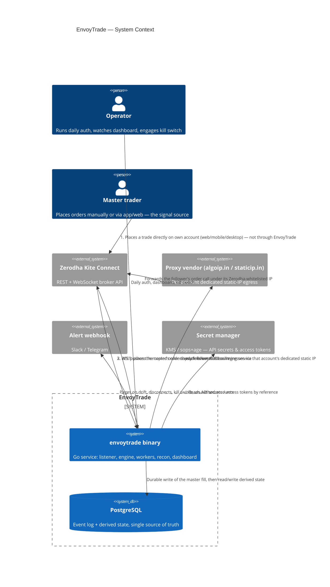
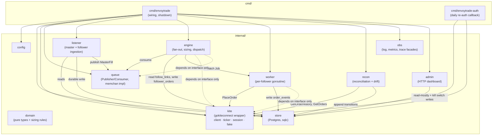
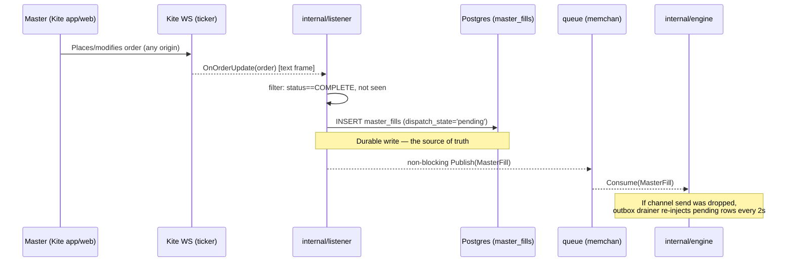
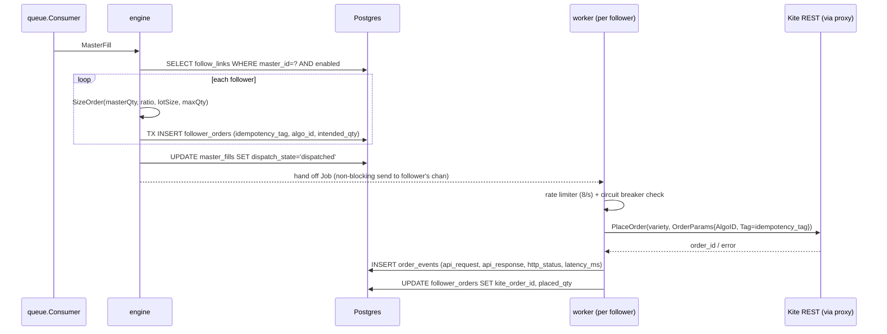
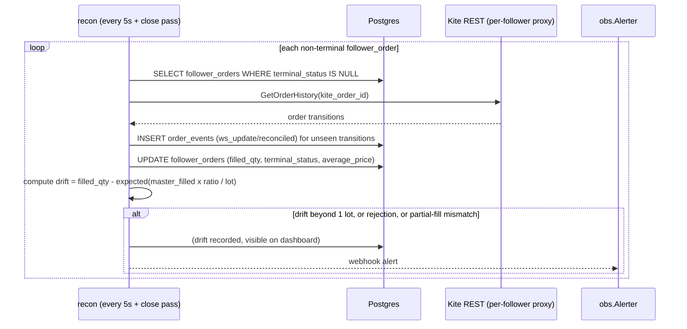
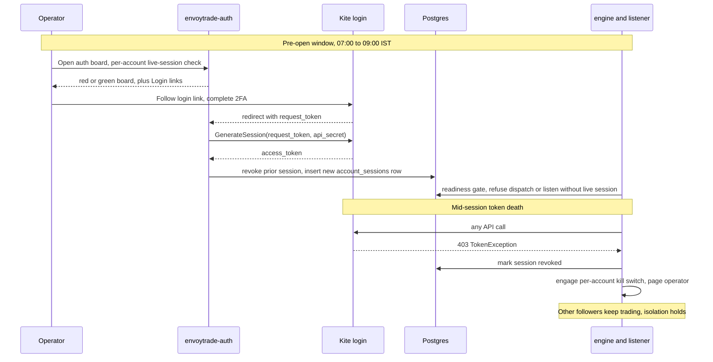
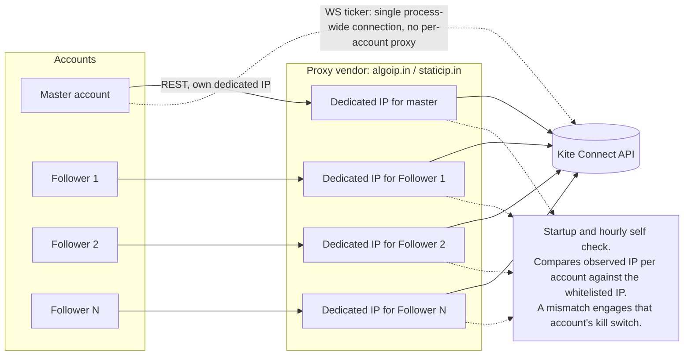
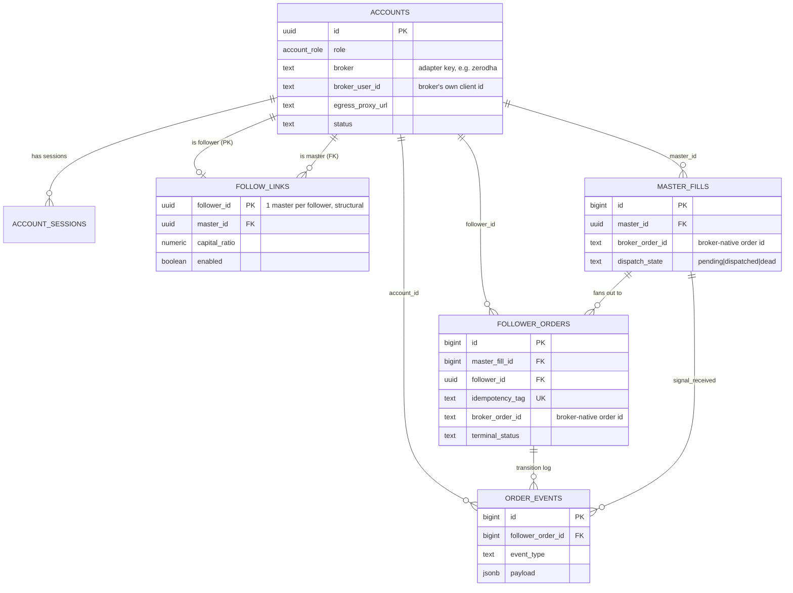
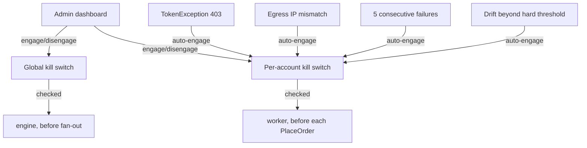
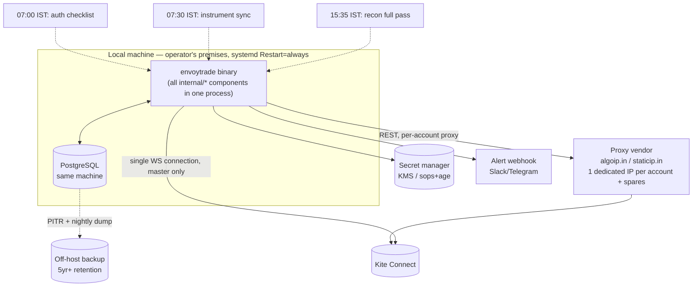

# EnvoyTrade V1 — Architecture

Companion to [PLAN.md](./PLAN.md). This document captures the system's structure and the
interactions between its components. It is derived from, not a substitute for, the plan —
see PLAN.md for rationale and alternatives considered.

---

## 1. System context

Single Go binary, single Postgres instance, one master trading account, N follower accounts,
each follower egressing through its own dedicated static-IP proxy. Zerodha Kite Connect is the
only external system.

---

## 2. Component / package map

One process; components are Go packages communicating in-memory. The only two seams meant to
survive a V2 rewrite are `queue` (dispatch transport) and `kite.Broker`/`BrokerFactory`
(broker abstraction) — see PLAN.md §1.

**Dependency rule (PLAN.md §1):** `engine` and `worker` import only the `queue`, `kite`,
`store`, `obs` *interfaces* — never `memchan` or `gokiteconnect` concretely. `main.go` is the
sole place concrete implementations are named.

---

## 3. Master signal capture (WS ticker)

Kite offers two channels for order events — HTTP postback and WS `OnOrderUpdate`. Postback only
notifies for orders placed via the app's own `api_key`; since the master places orders manually
through the Zerodha app, only the WS ticker sees them (PLAN.md §3.0).

Only **one** `Ticker` instance runs in the whole process (the master's) — gorilla's shared
package-level `websocket.DefaultDialer` makes per-instance proxying unsafe, so follower tickers
are never created (PLAN.md §3.4). Follower status instead comes from REST reconciliation.

---

## 4. Fan-out, sizing, and dispatch (transactional outbox)

The in-memory channel is a latency optimization only; Postgres is the durability boundary.

**Isolation:** each follower has its own goroutine, inbound buffered channel, `Broker` client
(own proxy egress), rate limiter, and circuit breaker. A stuck or panicking follower cannot
block another; an overflowing channel dead-letters that one `follower_order` (PLAN.md §4.3).

**Outbox drainer** (every 2s): sweeps `master_fills` still `pending` after 2s and re-injects
them into the engine — guarantees at-least-once even across a process crash between the
listener's write and the engine's consume (PLAN.md §4.1).

---

## 5. Reconciliation & drift detection

WS is the fast path; the reconciliation loop polling REST is the **authoritative** one — it is
also the only status channel for followers, since they have no ticker of their own.

---

## 6. Daily authentication lifecycle

Kite access tokens expire ~06:00 IST daily; login requires interactive 2FA (PLAN.md §3.2).

---

## 7. Egress isolation (static IP)

Every account's REST client is bound to its own dedicated proxy at construction time via
`Client.SetHTTPClient` — no change to the vendored SDK (PLAN.md §3.3).

---

## 8. Data model relationships

`follow_links.follower_id` as primary key structurally enforces "one master per follower" with
no trigger or application check (PLAN.md §2). `order_events` is the append-only SEBI audit
trail; `master_fills` + `follower_orders` are derived, mutable projections.

**Broker-agnostic by design.** V1 only ever writes `broker = 'zerodha'`, but no table encodes
Kite-specific identifiers as first-class columns — `broker_user_id` and `broker_order_id` hold
whatever the adapter's native id looks like, and `raw_payload`/`payload` (jsonb) absorb the
rest. Adding a second broker means a new `internal/<broker>` package implementing the same
`kite.Broker` interface (PLAN.md §1) and a new `accounts.broker` value — no migration to the
core event-log tables.

---

## 9. Kill switch — check points

---

## 10. Deployment topology (V1)

No k8s, no containers, no microservices — one process, one database, one machine by design
(PLAN.md §10). Static proxy IPs (§7 above) are what satisfy Zerodha's whitelisting
requirement, so the service does not need to be network-close to the exchange — it runs
wherever the operator's machine is.

---

## 11. Cross-reference to PLAN.md

| Architecture section | PLAN.md source |
|---|---|
| §2 Component map | §1 Package/module layout |
| §3 Master signal capture | §3.0, §3.1, §3.4 |
| §4 Fan-out & dispatch | §4.1 Durable-write-then-dispatch, §4.2 Sizing, §4.3 Worker isolation |
| §5 Reconciliation & drift | §5 Failure handling |
| §6 Auth lifecycle | §3.2 Token lifecycle |
| §7 Egress isolation | §3.3 Static IP for REST |
| §8 Data model | §2 Data model |
| §9 Kill switch | §5 Kill switch |
| §10 Deployment | §8 Deployment |
