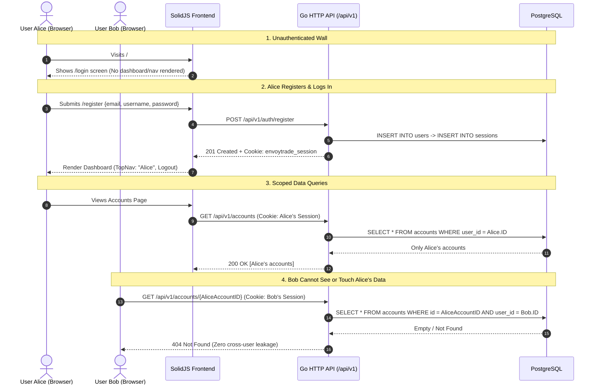

# EnvoyTrade Authentication & User Data Scoping — Architecture & Implementation Plan

## Overview
This document specifies the authentication and user-scoping architecture for EnvoyTrade. Currently, all `/api/v1/*` administrative endpoints and the SolidJS dashboard are unauthenticated and globally shared. Anyone with network access can view all accounts, execute broker orders, and modify groups across the entire system.

This plan establishes **User Authentication and Strict Data Scoping**:
- **Authentication Wall**: An unauthenticated visitor is strictly restricted to the Sign-In / Sign-Up screen. No dashboard data, accounts, analytics, or operations can be accessed without a valid session.
- **Strict Data Isolation (Multi-Tenancy)**: Every trading account (`accounts`) and copy group (`groups`) belongs to a specific `user_id`. Users can **only view, edit, or execute trades on their own data**. Data of other users is completely invisible and unreachable.
- **Storage**: PostgreSQL-backed `users` and `sessions` tables, plus `user_id` foreign keys on `accounts` and `groups`.
- **Identity Fields**: Every user has unique `email` and `username`.
- **Registration & Sign-In**:
  - Sign-up (`POST /api/v1/auth/register`) requires `email`, `username`, `password`, and optional `name`.
  - Sign-in (`POST /api/v1/auth/login`) requires `email` and `password`.
- **Credential Security**: Bcrypt-hashed passwords (`cost >= 12`) with an extensible schema for TOTP 2FA.
- **Session Transport**: HTTP-only, SameSite=Lax, Secure cookies (`envoytrade_session`) with HTTPS and reverse-proxy detection (`X-Forwarded-Proto`).
- **Hybrid Automation Access**: `Authorization: Bearer <token>` support for automated trading scripts and CLI operations.
- **Dedicated Webhook Integrity**: `POST /broker-callback` remains authenticated via Zerodha Kite HMAC-SHA256 signature verification and operates in the background.



---

## UI / UX Architecture & Route Protection

### 1. The Authentication Wall (Unauthenticated State)
- **Zero Data Exposure**: If the user does not possess an active session, no top navigation, sidebar, dashboard statistics, account tables, or analytics components are mounted.
- **Automatic Interception**: Any direct link access (`/`, `/accounts`, `/analytics`, `/accounts/groups/:id`) immediately displays the `/login` view without flash of unauthorized content (FOUC).
- **Session Resolution (Fast Skeleton)**: On initial page load, `AuthContext` makes a fast `GET /api/v1/auth/me` request.
  - While resolving, a minimal branded loader/skeleton is displayed.
  - If `200 OK`, `currentUser` is set and the app shell mounts.
  - If `401 Unauthorized`, the login/register screen is rendered.

### 2. Dual-Mode Auth Screen (`/login`)
- Clean slate/dark theme container matching EnvoyTrade's `#44475b` / `#04b488` color system:
  - **Tabs / Switcher**: Toggle between **Sign In** and **Sign Up**.
  - **Sign In Fields**:
    - Email (autofocused)
    - Password
    - "Sign In" button with loading spinner
  - **Sign Up Fields**:
    - Email
    - Username
    - Full Name (optional)
    - Password
    - "Create Account" button with loading spinner
  - **Error Display**: Clear, accessible inline alert for invalid credentials, duplicate email/username, or network error.

### 3. Authenticated App Shell & TopNav
Once signed in, the full navigation is unlocked:
- **Brand**: `EnvoyTrade` logo.
- **Navigation Links**: `Dashboard | Accounts | Analytics` (active state highlighted in teal `#04b488`).
- **User Identity Pill**: Displays the logged-in user's `name` or `email` (e.g. `👤 alice@envoytrade.com`).
- **Sign Out Action**: An explicit "Logout" button that calls `POST /api/v1/auth/logout`, clears browser session cookies, resets client state, and cleanly returns to the `/login` screen.
- **Theme Toggle**: Light / Dark mode toggle.

### 4. Global 401 Interceptor & Expiry Grace
- In `frontend/src/api.ts`: If any API call responds with `401 Unauthorized` (e.g. 24h session expired overnight), the API client automatically clears local auth signals and re-routes to `/login` with an informational toast: *"Session expired. Please sign in again."*

---

## User Data Scoping (Multi-Tenancy)

### 1. Database Schema Migration (`0011_users_and_sessions.sql` & `0012_user_scoping.sql`)

```sql
-- 0011_users_and_sessions.sql

CREATE TABLE IF NOT EXISTS users (
    id              uuid PRIMARY KEY DEFAULT gen_random_uuid(),
    email           text NOT NULL UNIQUE,
    username        text NOT NULL UNIQUE,
    name            text NOT NULL DEFAULT '',
    password_hash   text NOT NULL,
    totp_secret     text,
    totp_enabled    boolean NOT NULL DEFAULT false,
    role            text NOT NULL DEFAULT 'user',
    created_at      timestamptz NOT NULL DEFAULT now(),
    updated_at      timestamptz NOT NULL DEFAULT now()
);

CREATE UNIQUE INDEX IF NOT EXISTS idx_users_email_lower ON users (LOWER(email));
CREATE UNIQUE INDEX IF NOT EXISTS idx_users_username_lower ON users (LOWER(username));

CREATE TABLE IF NOT EXISTS sessions (
    id              bigserial PRIMARY KEY,
    token_hash      text NOT NULL UNIQUE,
    user_id         uuid NOT NULL REFERENCES users(id) ON DELETE CASCADE,
    ip_address      text,
    user_agent      text,
    expires_at      timestamptz NOT NULL,
    created_at      timestamptz NOT NULL DEFAULT now(),
    last_seen_at    timestamptz NOT NULL DEFAULT now()
);

CREATE INDEX IF NOT EXISTS idx_sessions_token_hash ON sessions (token_hash);
CREATE INDEX IF NOT EXISTS idx_sessions_expires_at ON sessions (expires_at);
CREATE INDEX IF NOT EXISTS idx_sessions_user_id ON sessions (user_id);
```

```sql
-- 0012_user_scoping.sql
-- Add user_id ownership to accounts and groups tables

ALTER TABLE accounts
    ADD COLUMN IF NOT EXISTS user_id uuid REFERENCES users(id) ON DELETE CASCADE;

CREATE INDEX IF NOT EXISTS idx_accounts_user_id ON accounts (user_id);

ALTER TABLE groups
    ADD COLUMN IF NOT EXISTS user_id uuid REFERENCES users(id) ON DELETE CASCADE;

CREATE INDEX IF NOT EXISTS idx_groups_user_id ON groups (user_id);
```

### 2. Scoped SQL Queries (`internal/store/postgres/queries/`)

All read, update, delete, and action queries are strictly scoped by `user_id`:

#### `accounts.sql`
```sql
-- name: AccountsByUser :many
SELECT a.id, a.name, a.role, a.broker, a.broker_user_id, a.api_key, a.api_secret, a.active, a.status, a.ip_address,
       a.auth_status, a.auth_error,
       g.id AS group_id, g.name AS group_name, g.master_id,
       f.capital_ratio, f.max_qty_per_order,
       COALESCE(f.enabled, true) AS enabled
FROM accounts a
LEFT JOIN follow_links f ON f.follower_id = a.id
LEFT JOIN groups g ON (g.id = f.group_id OR (a.role = 'master' AND g.master_id = a.id))
WHERE a.user_id = $1 AND (sqlc.narg('ids')::uuid[] IS NULL OR a.id = ANY(sqlc.narg('ids')::uuid[]))
ORDER BY LOWER(COALESCE(NULLIF(a.name, ''), a.broker_user_id)) ASC, a.id ASC;

-- name: CreateAccountWithUser :exec
INSERT INTO accounts (id, user_id, name, role, broker, broker_user_id, api_key, api_secret, ip_address, encrypted_password, encrypted_totp_secret)
VALUES ($1, $2, $3, $4, $5, $6, $7, $8, $9, $10, $11);

-- name: DeleteAccountScoped :execrows
DELETE FROM accounts WHERE id = $1 AND user_id = $2;

-- name: AccountOwnedByUser :one
SELECT id FROM accounts WHERE id = $1 AND user_id = $2;
```

#### `groups.sql`
```sql
-- name: GroupsByUser :many
SELECT g.id, g.name, g.master_id,
       a.broker_user_id AS master_broker_user_id,
       a.name AS master_name,
       a.broker,
       a.status,
       a.active,
       COUNT(f.follower_id)::int AS follower_count
FROM groups g
JOIN accounts a ON a.id = g.master_id
LEFT JOIN follow_links f ON f.group_id = g.id
WHERE g.user_id = $1
GROUP BY g.id, g.name, g.master_id, a.broker_user_id, a.name, a.broker, a.status, a.active
ORDER BY LOWER(g.name) ASC, g.id ASC;

-- name: GroupInfoScoped :one
SELECT g.id, g.name, g.master_id,
       a.broker_user_id AS master_broker_user_id,
       a.name AS master_name,
       a.active AS master_active
FROM groups g
JOIN accounts a ON a.id = g.master_id
WHERE (g.id = $1 OR g.master_id = $1) AND g.user_id = $2
LIMIT 1;

-- name: CreateGroupWithUser :exec
INSERT INTO groups (id, user_id, name, master_id)
VALUES ($1, $2, $3, $4);

-- name: DeleteGroupScoped :execrows
DELETE FROM groups WHERE id = $1 AND user_id = $2;
```

### 3. API Handler Authorization Enforcement (`internal/httpapi/`)

Every HTTP handler retrieves `user := UserFromContext(r.Context())` and executes operations scoped strictly to `user.ID`:
- `GET /api/v1/groups`: calls `store.GroupsByUser(ctx, user.ID)` — only returns groups created by this user.
- `POST /api/v1/groups`: sets `group.UserID = user.ID`.
- `GET /api/v1/groups/{id}`: verifies `group.UserID == user.ID`, returns `404 Not Found` if group belongs to another user.
- `DELETE /api/v1/groups/{id}`: deletes `WHERE id = $1 AND user_id = user.ID`.
- `GET /api/v1/accounts`: calls `store.AccountsByUser(ctx, user.ID, ids)`.
- `POST /api/v1/accounts`: creates account linked to `user.ID`.
- `PATCH /api/v1/accounts/{id}`: checks account ownership first.
- `DELETE /api/v1/accounts/{id}`: checks account ownership before deletion.
- `POST /api/v1/accounts/{id}/actions`: (Rebalance, Square Off, Exit Orders, Sync) verifies account is owned by `user.ID`. A malicious user cannot square off or rebalance another user's account!
- `GET /api/v1/accounts/{id}/orders`: checks account ownership before returning positions and holdings.

---

## Token Security & Session Architecture

```
Client Cookie / Header                PostgreSQL (sessions)
┌─────────────────────────────┐       ┌──────────────────────────────────────┐
│ Raw Token:                  │       │ Stored token_hash:                   │
│ a7f8c12... (32 random bytes)│──────▶│ SHA-256("a7f8c12...")                │
└─────────────────────────────┘       │ 5e884898da28047151d0e56f8dc6292773...│
                                      └──────────────────────────────────────┘
```

1. **Token Generation**: 32 cryptographically random bytes via `crypto/rand` hex-encoded (64 chars).
2. **Token Hashing**: `tokenHash = hex(sha256(plainToken))`. Only `tokenHash` is written to `sessions.token_hash`.
3. **Transport**: `Set-Cookie: envoytrade_session=<plainToken>; HttpOnly; SameSite=Lax; Path=/; Secure (when https)` + response JSON for scripts.
4. **Verification**: Server hashes incoming cookie/Bearer token with SHA-256 and retrieves user + session in a single join query.
5. **Rolling Expiration**: 24-hour lifetime extended when requests are older than 15 minutes since `last_seen_at`.

---

## Proposed Changes

### Component 1: Database Migrations (`internal/store/postgres`)
- `internal/store/postgres/migrations/0011_users_and_sessions.sql` [NEW]: `users` & `sessions` tables.
- `internal/store/postgres/migrations/0012_user_scoping.sql` [NEW]: `user_id` on `accounts` and `groups`.
- `internal/store/postgres/queries/auth.sql` [NEW]: user & session queries.
- `internal/store/postgres/queries/accounts.sql` [MODIFY]: scope account queries by `user_id`.
- `internal/store/postgres/queries/groups.sql` [MODIFY]: scope group queries by `user_id`.
- `internal/store/postgres/auth.go` [NEW]: Store auth methods.
- `internal/store/postgres/store.go` [MODIFY]: Embed migrations 11 & 12, update store methods with `userID`.

### Component 2: Core Domain & Security (`internal/domain`, `internal/auth`)
- `internal/domain/auth.go` [NEW]: `User`, `Session`, `SessionWithUser`.
- `internal/auth/password.go` [NEW]: bcrypt password hashing & constant-time validation.
- `internal/auth/token.go` [NEW]: crypto token generator & SHA-256 hasher.

### Component 3: HTTP API & Middleware (`internal/httpapi`)
- `internal/httpapi/auth.go` [NEW]: `POST /auth/register`, `POST /auth/login`, `POST /auth/logout`, `GET /auth/me`.
- `internal/httpapi/middleware_auth.go` [NEW]: Session extraction, token hash check, context user injection.
- `internal/httpapi/accounts.go` [MODIFY]: Enforce `user.ID` scoping on all account endpoints.
- `internal/httpapi/groups.go` [MODIFY]: Enforce `user.ID` scoping on all group endpoints.
- `internal/httpapi/orders.go` [MODIFY]: Check `user.ID` ownership before returning orders/holdings.
- `internal/httpapi/actions.go` [MODIFY]: Check `user.ID` ownership before executing rebalance/square-off.
- `internal/httpapi/router.go` [MODIFY]: Mount auth routes and protect `/api/v1/*`.
- `cmd/server/main.go` [MODIFY]: Background cleaner for expired sessions.

### Component 4: Frontend UI & Client Integration (`frontend`)
- `frontend/src/api.ts` [MODIFY]: `credentials: 'include'`, `register()`, `login()`, `logout()`, `getMe()`, 401 interceptor.
- `frontend/src/context/AuthContext.tsx` [NEW]: Reactive user session store.
- `frontend/src/pages/LoginPage.tsx` [NEW]: Tabbed Sign In / Sign Up form with error banner and loading states.
- `frontend/src/components/ProtectedRoute.tsx` [NEW]: Unauthenticated wall preventing any app access without login.
- `frontend/src/App.tsx` [MODIFY]: Route structure guarded by auth, TopNav with user email/name pill and Logout button.

---

## Verification Plan

### Automated Tests
1. **Auth & Token Tests**:
   - `internal/auth/password_test.go`: bcrypt verify, reject incorrect passwords.
   - `internal/auth/token_test.go`: random token entropy, SHA-256 hash idempotency.
2. **API & Scoping Tests**:
   - `internal/httpapi/auth_test.go`:
     - Register user creates session and cookie.
     - Login with email and password returns cookie.
     - 401 on unauthenticated access.
   - `internal/httpapi/scoping_test.go`:
     - User A cannot see User B's accounts (`GET /api/v1/accounts`).
     - User A cannot view User B's group detail (`GET /api/v1/groups/{id}`).
     - User A cannot trigger actions on User B's account (`POST /api/v1/accounts/{id}/actions` returns 404).
3. **Frontend Vitest Tests**:
   - `frontend/src/pages/LoginPage.test.tsx`: test Sign In and Sign Up tab switching, email/password validation, error alerts.
   - `frontend/src/context/AuthContext.test.tsx`: test login, logout, and 401 clearing.
   - `frontend/src/App.test.tsx`: test that unauthenticated user sees `/login` and authenticated user sees TopNav + Dashboard.
4. **Execution Commands**:
   ```sh
   go test ./internal/auth/... ./internal/httpapi/...
   pnpm -C frontend test --run
   ```

### Manual Verification
1. Boot server: access `http://localhost:8080` in an incognito window -> verify **only the Sign In / Sign Up screen appears**. No nav links, no tables, no operations possible.
2. Click "Sign Up": Register `alice@envoytrade.com` (username `alice`). Verify auto-login, redirect to Dashboard, and TopNav displays `alice@envoytrade.com` and Logout button.
3. Add master account and create a group `Alice-Algo`.
4. Open a second incognito browser window: Register `bob@envoytrade.com`.
5. On Bob's dashboard: verify **Group `Alice-Algo` is NOT visible**. Bob has an empty dashboard.
6. Try `curl -i http://localhost:8080/api/v1/groups` with Bob's cookie: verify Alice's group is not in the JSON response.
7. Try Bob making a POST request to rebalance Alice's account: verify `404 Not Found`.
8. Click "Logout" in Alice's window: verify cookie destroyed and UI transitions immediately back to `/login`.
