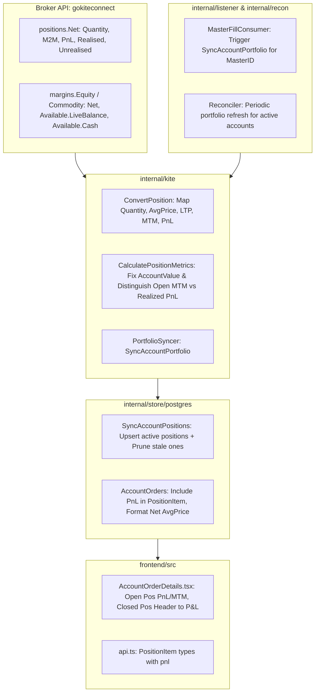

# Implementation Plan: Fix MTM Calculation & Portfolio Sync Inaccuracies

## Goal Description
Resolve critical inaccuracies and architectural gaps in how Mark-to-Market (MTM), profit/loss (P&L), positions, and margins are calculated, synced, and displayed across EnvoyTrade:
1. **Double-counting cash in `AccountValue`**: Zerodha Kite's `Available.LiveBalance` already includes `Available.Cash`. Adding them together double-counts cash in total account value.
2. **Conflating Day's MTM (`M2M`) with Overall Position P&L (`PnL`)**: Kite's `M2M` is calculated relative to yesterday's close for overnight positions. Discarding `PnL` and displaying only `M2M` makes overnight positions appear to have the wrong profit/loss relative to entry average price.
3. **Double-counting closed positions in `TotalMtm`**: `CalculatePositionMetrics` sums `p.M2M` across all positions including closed ones (`Quantity == 0`), making "Total MTM" equal to Day P&L rather than open unrealized MTM. Closed positions tab also labels realized P&L as "MTM".
4. **Master account portfolio never syncing on trade fills**: `MasterFillConsumer` never triggers portfolio sync upon execution, leaving master MTM/positions stale until a manual sync.
5. **Zombie / orphaned positions**: `SyncAccountPositions` only executes `UPSERT`, never pruning expired or closed contracts that drop out of Kite's payload on subsequent days.
6. **Static MTM during market hours**: Portfolio metrics only update on order completion or manual rebalance. Periodic background sync is needed during market hours.
7. **Display formatting anomalies**: Position average price currently displays as raw `BuyPrice/SellPrice` string (e.g. `24500.00/0.00`) instead of the true net average price for open positions.

> [!NOTE]
> The vendored `./gokiteconnect` directory is reference-only and will not be edited. All changes will be made within EnvoyTrade application packages.

---

## User Review Required

> [!IMPORTANT]
> **Definition of "Total MTM" vs "Realized P&L" in Summary Cards**:
> In standard Zerodha terminology:
> - **Total P&L / Day P&L**: Net sum of all position profits/losses for the day (both open MTM and closed realized).
> - **Unrealized MTM**: Mark-to-market of currently active open positions only (`Quantity != 0`).
> - **Realized P&L**: Booked profit/loss on closed positions (`Quantity == 0`).
>
> We propose:
> 1. In `CalculatePositionMetrics`, calculate:
>    - `UnrealizedPnl`: sum of `p.M2M` (or `p.Unrealised`) for **open positions only** (`p.Quantity != 0`).
>    - `RealizedPnl`: sum of `p.Realised` for closed/partially closed positions.
>    - `TotalMtm` (or `DayPnl`): `UnrealizedPnl + RealizedPnl` (net day's P&L).
> 2. In `domain.PositionItem`, include `pnl` (already stored in Postgres `account_positions.pnl`) alongside `mtm` so the UI can display both or prioritize total position P&L from entry.
> 3. In the Closed Positions tab, rename the table header from "MTM" to "P&L".

---

## Proposed Changes



---

### 1. `internal/kite` (Portfolio Metrics & Conversion)

#### [MODIFY] `internal/kite/portfolio_convert.go`
- **Fix Account Value**:
  Change `AccountValue` calculation to avoid double-counting `Available.Cash`. Use `margins.Equity.Net + margins.Commodity.Net` (or `Available.LiveBalance`), which represents actual net margin equity.
- **Differentiate Open MTM vs Realized P&L**:
  - `TotalMtm`: calculate as the net day's P&L (or pure open unrealized MTM, with clear semantics).
  - Open positions (`Quantity != 0`): track `UnrealizedPnl` (`p.M2M` / `p.Unrealised`).
  - Closed positions (`Quantity == 0`): track `RealizedPnl` (`p.Realised`).
- **Format / Map Position Average Price**:
  - In `ConvertPosition`: store Kite's `p.AveragePrice` into `BuyPrice` (for long) or `SellPrice` (for short), or calculate clean representation.

#### [MODIFY] `internal/kite/sync.go`
- Set `marginParam.AccountValue = summary.AvailableMargin` (LiveBalance) instead of `AvailableCash + AvailableMargin`.
- Ensure `Summary` correctly passes open MTM and realized P&L.

#### [MODIFY] `internal/kite/portfolio_convert_test.go` & `sync_test.go`
- Update unit tests with assertions verifying that cash is not double-counted and open/closed metrics are distinct.

---

### 2. `internal/store/postgres` (Storage & Querying)

#### [MODIFY] `internal/store/postgres/portfolio.go`
- **Prune Stale / Zombie Positions in `SyncAccountPositions`**:
  In a database transaction, after upserting current positions from the broker payload, delete any existing positions in `account_positions` for `accountID` whose `instrument` is not present in the new payload.

#### [MODIFY] `internal/store/postgres/orders.go`
- **Expose `Pnl` in `PositionItem`**:
  Populate `domain.PositionItem.Pnl` from `r.Pnl` (which is already selected from `account_positions` in `queries/positions.sql`).
- **Clean Net Average Price Display**:
  Instead of raw `"BuyPrice/SellPrice"` (e.g. `24500.00/0.00`), format as:
  - If `Quantity > 0`: `fmt.Sprintf("%.2f", r.BuyPrice.InexactFloat64())`
  - If `Quantity < 0`: `fmt.Sprintf("%.2f", r.SellPrice.InexactFloat64())`
  - If `Quantity == 0`: `fmt.Sprintf("%.2f / %.2f", r.BuyPrice.InexactFloat64(), r.SellPrice.InexactFloat64())`

---

### 3. `internal/domain` (Data Models)

#### [MODIFY] `internal/domain/types.go`
- Add `Pnl decimal.Decimal` to `PositionItem`:
  ```go
  type PositionItem struct {
      Product    string          `json:"product"`
      Instrument string          `json:"instrument"`
      Qty        int             `json:"qty"`
      AvgPrice   string          `json:"avgPrice"`
      Ltp        decimal.Decimal `json:"ltp"`
      Mtm        decimal.Decimal `json:"mtm"`
      Pnl        decimal.Decimal `json:"pnl"`
      Action     string          `json:"action,omitempty"`
  }
  ```

---

### 4. `internal/listener` & `cmd/server` (Master Sync Pipeline)

#### [MODIFY] `internal/listener/listener.go`
- Add `Syncer PortfolioSyncer` to `MasterFillConsumer`.
- In `MasterFillConsumer.Handle`: when a master fill successfully executes, spawn a background goroutine:
  ```go
  if c.Syncer != nil {
      go func(mID uuid.UUID) {
          _ = c.Syncer.SyncAccountPortfolio(context.Background(), mID)
      }(fill.MasterID)
  }
  ```

#### [MODIFY] `cmd/server/main.go`
- Pass `Syncer: syncer` to `listener.MasterFillConsumer`.

---

### 5. `internal/recon` (Periodic Portfolio Sync Backstop)

#### [MODIFY] `internal/recon/reconciler.go`
- Add portfolio synchronization to periodic recon loop (e.g. every 60s) for accounts with active sessions, ensuring MTM does not remain static during market hours when no new orders are placed.

---

### 6. Frontend (`frontend/src/`)

#### [MODIFY] `frontend/src/api.ts`
- Add `pnl?: number | string` to `PositionItem` interface.

#### [MODIFY] `frontend/src/components/AccountOrderDetails.tsx`
- In Closed Positions table: rename header from "MTM" to "P&L".
- In Open Positions table: render P&L / MTM accurately with positive/negative color indicators.

---

## Verification Plan

### Automated Tests
1. **Backend Unit Tests**:
   ```sh
   go test -v ./internal/kite/...
   go test -v ./internal/listener/...
   go test -v ./internal/recon/...
   go test -v ./internal/httpapi/...
   ```
2. **Integration Tests (Postgres)**:
   ```sh
   go test -tags integration ./internal/store/postgres/... -v -run TestPortfolio
   ```
3. **Frontend Tests**:
   ```sh
   pnpm -C frontend test --run
   pnpm -C frontend build
   ```

### Manual Verification
1. Run local dev server (`make db-up && make db-seed && go run ./cmd/server`).
2. Open account drawer on the dashboard:
   - Check summary card: verify `Account Value` equals net available margin without doubling cash.
   - Check Open Positions table: verify `Avg Price` displays clean single price (`150.00` instead of `150.00/0.00`) and displays correct P&L/MTM.
   - Check Closed Positions table: verify column header reads "P&L" instead of "MTM".
   - Trigger trade or sync: verify master and follower accounts both update MTM upon fill.
