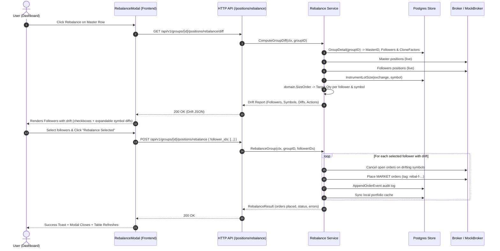

# Portfolio Rebalance Feature: Implementation Plan

> *"Perfectly balanced, as all things should be."*

## Goal Description
Implement the **Cluster and Account Portfolio Rebalance** feature across EnvoyTrade. When a follower account drifts from the master account's open positions (due to network drops, broker order rejections, margin shortfalls, manual intervention, or partial fills), the master account serves as the canonical source of truth.

The Rebalance button on a Master row opens a dedicated **Rebalance Modal** showing the live position diff across all linked followers in the cluster, with follower selection checkboxes, expandable symbol breakdowns, and automated market order execution to bring followers into perfect equilibrium. Individual follower rows also support single-account rebalancing.

---

## Architecture & Data Flow



---

## User Review Required

> [!IMPORTANT]
> **Rogue & Leftover Positions:** If a follower has an open position in an instrument where Master currently holds **0 quantity**, the rebalance target is **0** (the follower will place an exit market order to close it out), ensuring strict copy fidelity.

> [!NOTE]
> **Pre-Execution Order Cancellation:** Prior to placing rebalance market orders, any active pending limit orders for drifting symbols on that follower are cancelled automatically to prevent subsequent duplicate fills.

---

## Proposed Changes

### 1. API Documentation

#### [NEW] [`docs/APIs/rebalance.md`](file:///Users/msp/MSP/Projects/EnvoyTrade/docs/APIs/rebalance.md)
Document the 4 new endpoints following `docs/APIs/positions.md` convention:
- `GET /api/v1/groups/{group_id}/positions/rebalance/diff`: Get cluster drift preview.
- `POST /api/v1/groups/{group_id}/positions/rebalance`: Execute rebalance for selected (or all) followers in a group.
- `GET /api/v1/accounts/{account_id}/positions/rebalance/diff`: Get single follower drift preview.
- `POST /api/v1/accounts/{account_id}/positions/rebalance`: Execute rebalance for a single follower.

#### [MODIFY] [`docs/APIs/README.md`](file:///Users/msp/MSP/Projects/EnvoyTrade/docs/APIs/README.md)
Link `rebalance.md` in the API documentation index.

---

### 2. Domain & Sizing Models

#### [MODIFY] [`internal/domain/types.go`](file:///Users/msp/MSP/Projects/EnvoyTrade/internal/domain/types.go)
Add data structures for Rebalance Diff and Results:
```go
type SymbolDrift struct {
    Exchange        string          `json:"exchange"`
    Tradingsymbol   string          `json:"tradingsymbol"`
    Product         string          `json:"product"`
    LotSize         int             `json:"lot_size"`
    MasterQty       int             `json:"master_qty"`
    TargetQty       int             `json:"target_qty"`
    FollowerQty     int             `json:"follower_qty"`
    DriftQty        int             `json:"drift_qty"`
    Action          string          `json:"action"` // BUY | SELL
}

type FollowerDrift struct {
    AccountID       uuid.UUID       `json:"account_id"`
    AccountName     string          `json:"account_name"`
    BrokerAccountID string          `json:"broker_account_id"`
    Enabled         bool            `json:"enabled"`
    CloneFactor     decimal.Decimal `json:"clone_factor"`
    Symbols         []SymbolDrift   `json:"symbols"`
}

type GroupRebalanceDiff struct {
    GroupID              uuid.UUID       `json:"group_id"`
    MasterID             uuid.UUID       `json:"master_id"`
    FollowersEvaluated   int             `json:"followers_evaluated"`
    FollowersWithDrift   int             `json:"followers_with_drift"`
    Drifts               []FollowerDrift `json:"drifts"`
}

type RebalanceOrder struct {
    AccountID     uuid.UUID `json:"account_id"`
    BrokerOrderID string    `json:"broker_order_id"`
    Exchange      string    `json:"exchange"`
    Tradingsymbol string    `json:"tradingsymbol"`
    Product       string    `json:"product"`
    Side          string    `json:"side"`
    Quantity      int       `json:"quantity"`
    Status        string    `json:"status"`
}

type RebalanceResult struct {
    Action            string           `json:"action"`
    Status            string           `json:"status"` // completed | partial | empty
    GroupID           *uuid.UUID       `json:"group_id,omitempty"`
    AccountID         *uuid.UUID       `json:"account_id,omitempty"`
    FollowersAffected int              `json:"followers_affected"`
    OrdersPlaced      int              `json:"orders_placed"`
    Orders            []RebalanceOrder `json:"orders"`
    Errors            []string         `json:"errors"`
}
```

---

### 3. Backend Rebalance Engine

#### [NEW] [`internal/rebalance/service.go`](file:///Users/msp/MSP/Projects/EnvoyTrade/internal/rebalance/service.go)
Create `rebalance.Service`:
- Seam interfaces:
  - `Store`: `GroupDetail(ctx, groupID)`, `AccountRole(ctx, accountID)`, `InstrumentLotSize(ctx, exchange, symbol)`, `AppendOrderEvent(ctx, ev)`.
  - `BrokerResolver`: `ResolveBroker(ctx, accountID) (broker.Broker, error)`.
  - `PortfolioSyncer`: `SyncAccountPortfolio(ctx, accountID) error`.
- Methods:
  - `ComputeGroupDiff(ctx context.Context, groupID uuid.UUID) (domain.GroupRebalanceDiff, error)`
  - `ComputeAccountDiff(ctx context.Context, accountID uuid.UUID) (domain.FollowerDrift, error)`
  - `RebalanceGroup(ctx context.Context, groupID uuid.UUID, followerIDs []uuid.UUID) (domain.RebalanceResult, error)`
  - `RebalanceAccount(ctx context.Context, accountID uuid.UUID) (domain.RebalanceResult, error)`
- Uses `domain.SizeOrder` for exact lot-size math.
- Generates idempotent broker tags: `rebal-f-{shortID}-{ts}`.

#### [NEW] [`internal/rebalance/service_test.go`](file:///Users/msp/MSP/Projects/EnvoyTrade/internal/rebalance/service_test.go)
Unit tests for `rebalance.Service`:
- Drift calculation with fractional clone factors (0.5x, 1.5x) and lot constraints.
- Rogue position detection and square-off targeting.
- Pre-order cancellation verification.
- Partial failure and error aggregation.

---

### 4. HTTP API Handlers & Routing

#### [NEW] [`internal/httpapi/rebalance.go`](file:///Users/msp/MSP/Projects/EnvoyTrade/internal/httpapi/rebalance.go)
HTTP handlers:
- `getGroupRebalanceDiff`
- `postGroupRebalance`
- `getAccountRebalanceDiff`
- `postAccountRebalance`

#### [MODIFY] [`internal/httpapi/router.go`](file:///Users/msp/MSP/Projects/EnvoyTrade/internal/httpapi/router.go)
Register the routes on the mux with session auth protection:
- `GET /api/v1/groups/{id}/positions/rebalance/diff`
- `POST /api/v1/groups/{id}/positions/rebalance`
- `GET /api/v1/accounts/{id}/positions/rebalance/diff`
- `POST /api/v1/accounts/{id}/positions/rebalance`

#### [MODIFY] [`cmd/server/main.go`](file:///Users/msp/MSP/Projects/EnvoyTrade/cmd/server/main.go)
Instantiate `rebalance.NewService` and pass it into `httpapi.NewHandler`.

---

### 5. Frontend UI

#### [MODIFY] [`frontend/src/api.ts`](file:///Users/msp/MSP/Projects/EnvoyTrade/frontend/src/api.ts)
Add API clients:
- `getGroupRebalanceDiff(groupId: string): Promise<GroupRebalanceDiff>`
- `rebalanceGroup(groupId: string, followerIds?: string[]): Promise<RebalanceResult>`
- `getAccountRebalanceDiff(accountId: string): Promise<FollowerDrift>`
- `rebalanceAccount(accountId: string): Promise<RebalanceResult>`

#### [NEW] [`frontend/src/components/RebalanceModal.tsx`](file:///Users/msp/MSP/Projects/EnvoyTrade/frontend/src/components/RebalanceModal.tsx)
Build the Rebalance modal:
- Header with Thanos Balance Icon and title "Cluster Rebalance" or "Follower Rebalance".
- Fetches diff on modal open with loading skeleton.
- Select All checkbox + individual follower checkboxes.
- Follower cards/rows with badge showing count of drifting symbols.
- Chevron toggle to expand/collapse detailed symbol diff table:
  - Exchange:Symbol
  - Master Qty vs Target Qty vs Current Qty
  - Drift Delta & Side Badge (`BUY` / `SELL`)
- Empty state: "All followers are perfectly balanced with master."
- "Rebalance Selected Followers" primary action button with loading spinner and disabled state.
- Error banner on failures.

#### [MODIFY] [`frontend/src/components/AccountTable.tsx`](file:///Users/msp/MSP/Projects/EnvoyTrade/frontend/src/components/AccountTable.tsx)
- Wire `onRebalance` on Master row to open `RebalanceModal` for the group.
- Wire `onRebalance` on Follower rows to open `RebalanceModal` for that single follower.

#### [MODIFY] [`frontend/src/components/AccountRow.tsx`](file:///Users/msp/MSP/Projects/EnvoyTrade/frontend/src/components/AccountRow.tsx)
- Connect rebalance action to trigger the modal callback rather than direct blind action dispatch.

---

### 6. Integration & End-to-End Tests

#### [NEW] [`tests/e2e/rebalance_test.go`](file:///Users/msp/MSP/Projects/EnvoyTrade/tests/e2e/rebalance_test.go)
Comprehensive test suite using the real mock broker (`testbroker`):
1. **Positive Scenario (Missed signal / 0 qty follower):**
   Master opens 75 NIFTY futures, follower misses order (0 qty).
   `GET .../diff` detects 75 qty BUY drift.
   `POST .../rebalance` executes. Follower net position matches 75.
2. **Rogue Position Clean-up:**
   Follower has 50 RELIANCE position, Master has 0.
   `GET .../diff` detects 50 qty SELL drift.
   `POST .../rebalance` executes. Follower position is flattened to 0.
3. **Partial Position / Disproportionate Drift:**
   Master has 100, Follower has 25 (Target 100).
   `POST .../rebalance` places BUY for 75.
4. **Selective Follower Rebalance:**
   Follower A and Follower B both drift. Rebalance requested only for Follower A.
   Follower A is balanced; Follower B remains untouched.
5. **Clean Equilibrium:**
   Cluster already in sync. Returns empty drift, 0 orders placed.
6. **Broker Rejection / Error Handling:**
   Simulated broker error on one follower returns `status: partial` with errors reported without corrupting the cluster.

---

## Verification Plan

### Automated Tests
```sh
# 1. Fast unit tests for rebalance service & domain logic
go test ./internal/rebalance/... ./internal/domain/...

# 2. HTTP API tests
go test ./internal/httpapi/... -run TestRebalance

# 3. Frontend unit tests
pnpm -C frontend test --run

# 4. E2E tests against testbroker
go test -tags e2e ./tests/e2e/... -run TestE2E_Rebalance -v
```

### Manual Verification
1. Launch local dev stack with `make db-up` and testbroker running.
2. Open Dashboard at `http://localhost:3000`.
3. Click the **Rebalance** icon on the Master row.
4. Verify the modal pops up showing the diff for any followers that are out of sync.
5. Expand a follower to inspect the symbol-level diff details.
6. Select/deselect followers and confirm.
7. Observe the smooth 2.4s rotating animation on the button and verify toast feedback.
8. Re-open modal and confirm all positions report in perfect equilibrium.
