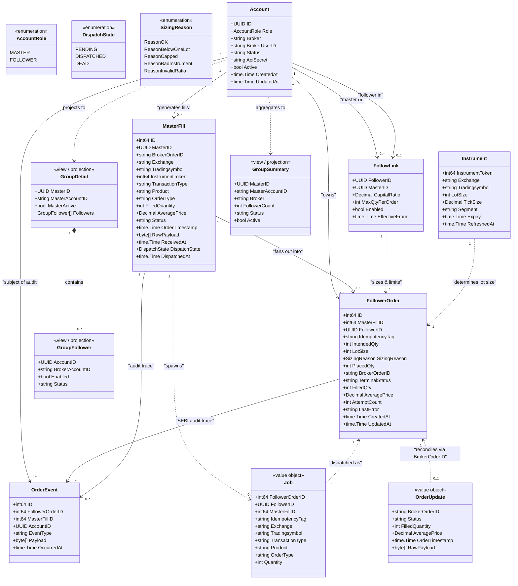
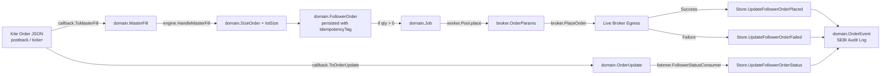

# EnvoyTrade Entity & Architecture Diagrams

This document captures the class diagrams, entity relationships, interface seams, and structural improvement recommendations for EnvoyTrade.

---

## 1. Domain Entities & Database Schema Class Diagram

This diagram captures the core business entities, persistence records, and value objects in `internal/domain` and `internal/store/postgres`.



---

## 2. Component Architecture & Interface Seams Class Diagram

EnvoyTrade uses consumer-defined interfaces ("The Seam Rule"). This diagram illustrates the service boundaries, interfaces, and concrete adapters.

```mermaid
classDiagram
    direction TB

    namespace CallbackIngestion {
        class Handler {
            -AccountLookup Accounts
            -Publisher~MasterFill~ MasterFills
            -Publisher~OrderUpdate~ FollowerUpdates
            +ServeHTTP(w, r)
        }
        class MasterTicker {
            -Conn conn
            -UUID masterID
            -Publisher~MasterFill~ publisher
            +Start(ctx)
            +Stop()
        }
        class AccountLookup {
            <<interface>>
            +AccountByBrokerUserID(ctx, brokerUserID) (UUID, role, secret, error)
        }
        class Conn {
            <<interface>>
            +OnOrderUpdate(func)
            +ServeWithContext(ctx)
            +Close()
        }
    }

    namespace Transport {
        class Publisher~T~ {
            <<interface>>
            +Publish(ctx, event) error
        }
        class Consumer~T~ {
            <<interface>>
            +Consume(ctx, fn) error
        }
        class MemchanQueue~T~ {
            -chan T ch
            +Publish(ctx, event) error
            +Consume(ctx, fn) error
        }
    }

    namespace Listener {
        class MasterFillConsumer {
            -MasterFillStore Store
            -MasterFillEngine Engine
            +Handle(ctx, MasterFill) error
            +Run(ctx, Consumer~MasterFill~) error
        }
        class FollowerStatusConsumer {
            -FollowerStatusStore Store
            +Handle(ctx, OrderUpdate) error
            +Run(ctx, Consumer~OrderUpdate~) error
        }
        class MasterFillStore {
            <<interface>>
            +InsertMasterFill(ctx, MasterFill) (int64, error)
        }
        class MasterFillEngine {
            <<interface>>
            +HandleMasterFill(ctx, MasterFill) error
        }
        class FollowerStatusStore {
            <<interface>>
            +UpdateFollowerOrderStatus(ctx, brokerOrderID, status, filledQty, avgPrice) (int64, error)
            +GetFollowerOrder(ctx, id) (FollowerOrder, error)
            +AppendOrderEvent(ctx, OrderEvent) error
        }
    }

    namespace FanOutEngine {
        class Engine {
            -Store store
            -Dispatcher dispatcher
            +HandleMasterFill(ctx, MasterFill) error
        }
        class EngineStore {
            <<interface>>
            +MasterActive(ctx, masterID) (bool, error)
            +EnabledFollowLinks(ctx, masterID) ([]FollowLink, error)
            +InstrumentLotSize(ctx, exchange, symbol) (int, error)
            +InsertFollowerOrder(ctx, FollowerOrder) (int64, error)
            +SetMasterFillDispatchState(ctx, id, state) error
            +UpdateFollowerOrderFailed(ctx, id, status, err) error
        }
        class Dispatcher {
            <<interface>>
            +Dispatch(followerID, Job) bool
        }
    }

    namespace WorkerExecution {
        class WorkerPool {
            -map~UUID, chan Job~ workers
            -sync.WaitGroup wg
            +Register(ctx, followerID, Broker, Store, buffer)
            +Dispatch(followerID, Job) bool
            +Shutdown()
        }
        class WorkerStore {
            <<interface>>
            +UpdateFollowerOrderPlaced(ctx, id, brokerOrderID, qty) error
            +UpdateFollowerOrderFailed(ctx, id, status, err) error
            +AppendOrderEvent(ctx, OrderEvent) error
        }
        class Broker {
            <<interface>>
            +PlaceOrder(ctx, variety, OrderParams) (OrderResponse, error)
        }
        class FakeBroker {
            +PlaceOrder(ctx, variety, OrderParams) (OrderResponse, error)
        }
        class OrderParams {
            +string Exchange
            +string Tradingsymbol
            +string TransactionType
            +string Product
            +string OrderType
            +int Quantity
            +string Tag
        }
    }

    namespace HttpAPI {
        class HttpRouter {
            +NewRouter(Store, Engine) ServeMux
        }
        class HttpStore {
            <<interface>>
            GroupsStore
            AccountsStore
            ActionsStore
        }
        class HttpEngine {
            <<interface>>
            +HandleMasterFill(ctx, MasterFill) error
        }
    }

    namespace PostgresStore {
        class Store {
            -pgxpool.Pool pool
            -sqlcgen.Queries queries
            +Migrate(ctx) error
            +AccountByBrokerUserID(...)
            +EnabledFollowLinks(...)
            +InsertMasterFill(...)
            +InsertFollowerOrder(...)
            +UpdateFollowerOrderStatus(...)
            +Groups(...)
            +GroupDetail(...)
        }
    }

    %% Implementations and structural satisfies
    MemchanQueue ..|> Publisher : implements
    MemchanQueue ..|> Consumer : implements

    WorkerPool ..|> Dispatcher : satisfies structurally
    FakeBroker ..|> Broker : implements
    Broker ..> OrderParams : accepts

    Engine ..|> MasterFillEngine : satisfies structurally
    Engine ..|> HttpEngine : satisfies structurally

    Store ..|> AccountLookup : satisfies structurally
    Store ..|> MasterFillStore : satisfies structurally
    Store ..|> FollowerStatusStore : satisfies structurally
    Store ..|> EngineStore : satisfies structurally
    Store ..|> WorkerStore : satisfies structurally
    Store ..|> HttpStore : satisfies structurally

    Handler --> AccountLookup : uses
    Handler --> Publisher : publishes
    MasterTicker --> Conn : wraps
    MasterTicker --> Publisher : publishes

    MasterFillConsumer --> MasterFillStore : uses
    MasterFillConsumer --> MasterFillEngine : delegates to
    FollowerStatusConsumer --> FollowerStatusStore : uses

    Engine --> EngineStore : uses
    Engine --> Dispatcher : uses

    WorkerPool --> WorkerStore : uses
    WorkerPool --> Broker : executes via
```



---

## 3. Order Data Flow & Transformation Diagram



---

## 4. Simplifications, Extensibility & Duplication Reductions

### A. Consolidate `domain.Job` and `broker.OrderParams` into a Shared `OrderIntent`
* **Issue:** `domain.Job` and `broker.OrderParams` have 7 duplicate fields (`Exchange`, `Tradingsymbol`, `TransactionType`, `Product`, `OrderType`, `Quantity`, `IdempotencyTag`/`Tag`). In `worker/pool.go`, manual field-by-field copy is performed inside `p.place()`.
* **Fix:** Define an embedded `OrderSpec` / `OrderIntent` value object in `internal/domain`:
  ```go
  type OrderSpec struct {
      Exchange        string
      Tradingsymbol   string
      TransactionType string // BUY|SELL
      Product         string // CNC|MIS|NRML
      OrderType       string // MARKET|LIMIT
      Quantity        int
  }
  ```
  `domain.Job` embeds `OrderSpec` + routing IDs (`FollowerOrderID`, `FollowerID`, `Tag`). `broker.OrderParams` embeds `OrderSpec` + `Tag`. Zero field copying required.

### B. Eliminate SQLC vs Domain Struct Duplication via `sqlc.yaml` Overrides
* **Issue:** Sqlc generates parallel structs in `sqlcgen/models.go` with `int32` and `pgtype.Timestamptz`. Every read/write method in `postgres/store.go` manually copies 15+ fields between `sqlcgen.FollowerOrder` / `sqlcgen.MasterFill` and `domain.*`.
* **Fix:** Use sqlc's `overrides` in `sqlc.yaml` to bind columns directly to Go types:
  ```yaml
  version: "2"
  sql:
    - schema: "internal/store/postgres/migrations"
      queries: "internal/store/postgres/queries"
      gen:
        go:
          package: "sqlcgen"
          out: "internal/store/postgres/sqlcgen"
          overrides:
            - db_type: "timestamptz"
              go_type: "time.Time"
            - db_type: "integer"
              go_type: "int"
  ```
  This cuts hundreds of lines of mapping boilerplate in `store.go`, `groups.go`, and `convert.go`.

### C. Remove HTTP Response DTO Mirroring
* **Issue:** `httpapi/groups.go` defines `groupSummaryResponse`, `groupFollowerResponse`, and `groupDetailResponse`, which are identical to `domain.GroupSummary`, `domain.GroupFollower`, and `domain.GroupDetail` except UUIDs are strings.
* **Fix:** `uuid.UUID` already marshals directly to standard UUID strings in JSON (`json.Marshaler`). Adding `json:"..."` tags to `domain.GroupSummary` / `domain.GroupDetail` allows `httpapi` to return domain models directly with `writeJSON(w, http.StatusOK, groups)`, eliminating 3 redundant structs and two O(N) mapping loops.

### D. Decouple Broker Credentials from `Account` Entity
* **Issue:** `accounts.api_secret` was added directly onto the `accounts` table (`0003_account_api_secret.sql`).
* **Problem:** Ties Kite-specific authentication directly to the identity table. Future brokers (e.g. Dhan, Fyers, AngelOne) need API keys, TOTP seeds, or OAuth refresh tokens.
* **Fix:** Separate broker credentials into an extensible `broker_accounts` or `broker_credentials` table:
  ```sql
  CREATE TABLE broker_credentials (
    account_id uuid PRIMARY KEY REFERENCES accounts(id),
    broker text NOT NULL,
    credentials jsonb NOT NULL, -- encrypted or structured credentials
    updated_at timestamptz NOT NULL DEFAULT now()
  );
  ```

### E. Command Pattern for Account Actions
* **Issue:** `httpapi/actions.go` has a hardcoded switch on action string (`rebalance`, `square_off`, `exit_open_orders`) with separate dummy error branches.
* **Fix:** Define an `AccountAction` interface:
  ```go
  type AccountAction interface {
      Execute(ctx context.Context, accountID uuid.UUID) error
  }
  ```
  Register handlers into a map `map[string]AccountAction`. Adding new actions (`square_off`, `exit_orders`, `sync_positions`) becomes a clean plug-in without modifying the HTTP handler router.
