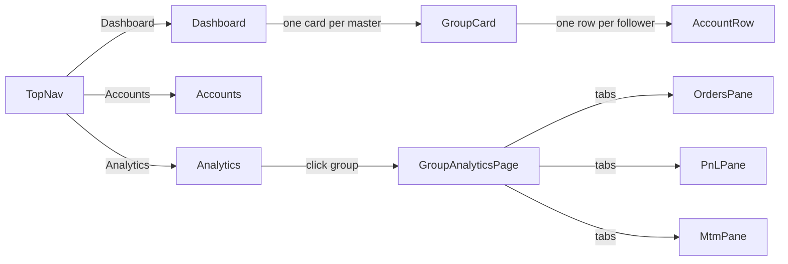
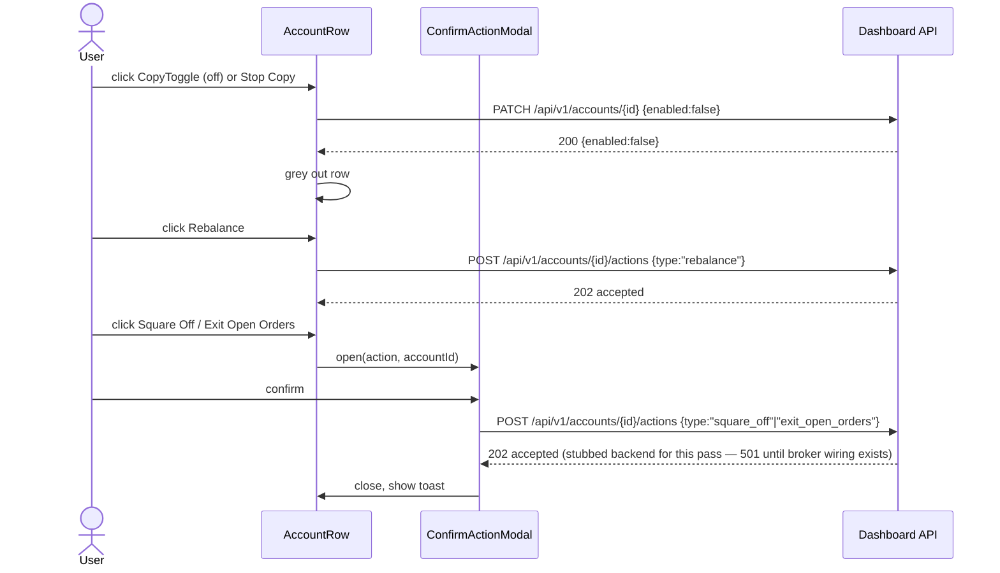

# EnvoyTrade — Dashboard UI Plan

Docs-only artifact: SolidJS component plan for the admin dashboard. No backend implementation here —
API requirements this UI needs are tracked separately in `docs/APIs/`.

## Stack

- **SolidJS 2.x** — fine-grained reactivity (no VDOM), small runtime, snappy for live-updating numbers
  (MTM, net qty). As of writing 2.0 is RC-only; pin to Solid 1.x until 2.0 reaches GA, then upgrade.
- **Solid Router** for `/`, `/accounts`, `/analytics`.
- **Vite** for dev/build.
- Charting library for Analytics — `lightweight-charts` or `chart.js`, pick at implementation time; not
  a blocker for this plan.
- Theming via CSS variables (see palette below) driven by a single `ThemeProvider` — no per-component
  hardcoded colors.

## Color palette

See `AGENTS.md` → "UI color palette" for the canonical table (source of truth, reused here). Exposed as
CSS custom properties, e.g.:

```css
:root[data-theme="light"] {
  --color-primary: #44475b;
  --color-accent: #04b488;
  --color-border: #f0f0f2;
  --color-text: #44475b;
  --color-bg: #ffffff;
  --color-surface: #f5f5f7;
}
:root[data-theme="dark"] {
  --color-primary: #1a1c24;
  --color-accent: #06d896;
  --color-border: #2a2c34;
  --color-text: #f0f0f2;
  --color-bg: #0f1117;
  --color-surface: #1a1c24;
}
```

## Global shell

- **`TopNav`** — brand/logo left, nav links `Dashboard | Accounts | Analytics` (Solid Router `<A>`,
  active-link styling via `--color-accent`), light/dark toggle right (flips `data-theme`).

## Component tree

```
App
└─ ThemeProvider
   └─ TopNav
   └─ <Router>
      ├─ DashboardPage        (/)
      │  └─ GroupList
      │     └─ GroupCard (per master)
      │        ├─ StatusDot (group-level rollup)
      │        └─ AccountTable
      │           └─ AccountRow (per follower)
      │              ├─ CopyToggle        (left)
      │              ├─ StatusDot
      │              └─ action icon buttons (right): StopCopy, Rebalance, SquareOff, ExitOrders
      │                 └─ ConfirmActionModal (SquareOff / ExitOrders only)
      ├─ AccountsPage         (/accounts)
      │  ├─ AccountsTable      (reuses DataTable)
      │  └─ AccountDetailDrawer (create/edit)
      └─ AnalyticsPage        (/analytics)
         └─ GroupList (reused)
            └─ GroupAnalyticsPage (/analytics/{masterId})
               ├─ FiltersBar (date range)
               ├─ OrdersPane   (reuses DataTable)
               ├─ PnLPane      (PnLChart + streak strip)
               └─ MtmPane      (PnLChart, MTM series)
```

**Reused primitives** (built once, used everywhere): `DataTable`, `StatusDot`, `ConfirmActionModal`,
`CopyToggle`, `ThemeProvider`. No page gets a bespoke table or modal.

## Dashboard page (`/`)

Home screen lists trade groups. A group = one master account + its follower accounts (master's fills
arrive via Kite postback/webhook and are copied to followers — see `internal/listener`/`internal/engine`
in the Go backend).

**`GroupCard`**: header shows master account id + group-level `StatusDot` (red if any follower errors).
Body is one `AccountTable` of that master's followers.

**`AccountTable`** columns, in order:

| Column | Notes |
|---|---|
| Account ID | broker account id |
| Net Qty | net quantity traded |
| Positions (O/C) | `<open>/<closed>` |
| Open Orders | count |
| Total MTM | currency |
| Available Cash | currency |
| Available Margin | currency |
| Status | `StatusDot` — green ok / red error |

**`AccountRow`**:
- Left of the row (followers only, **not** the master row): `CopyToggle` bound to the follow-link's
  enabled state — on/off controls whether master fills are copied to this follower.
- Right of the row, 4 icon buttons:
  1. 🚫 **Stop Copy** — greys out the row and stops copying (same underlying state as `CopyToggle`
     turned off; clicking either updates the other).
  2. ⚖️ **Rebalance** — re-copies a trade that didn't sync correctly. No confirmation needed (non-destructive,
     idempotent on the backend).
  3. ⍈ **Square Off** — exits all open positions for the account. Destructive — routes through
     `ConfirmActionModal`.
  4. |-> **Exit Open Orders** — cancels all open orders for the account. Destructive — routes through
     `ConfirmActionModal`.
- Row visually greys out (reduced opacity, numeric cells dimmed) whenever copying is disabled — one
  boolean drives both the toggle state and the grey-out, not two separate flags.

## Accounts page (`/accounts`)

Lists trade groups (masters), not a flat account list — clicking a group expands its followers. Same
grouping concept as the Dashboard, different purpose (manage accounts vs. monitor live numbers).

- **`GroupList`** (reused from Dashboard) — one row per master: Account ID, Broker User ID, Broker,
  Follower Count, Status. Row click expands/collapses to show that master's followers inline.
- Expanded followers render via **`AccountsTable`** (reuses `DataTable`): Account ID, Role, Broker User
  ID, Broker, Capital Ratio, Max Qty/Order, Status.
- Row click on any account (master or follower) opens **`AccountDetailDrawer`** to edit; a top-level
  "Add Account" button opens the same drawer empty.

**`AccountDetailDrawer` fields** (create/edit form — matches `accounts`/`follow_links` columns in
`internal/store/postgres`, nothing invented):

| Field | Applies to | Notes |
|---|---|---|
| Broker | both | Dropdown — only `Kite` selectable for now (`accounts.broker`, currently free-text defaulting to `zerodha`; dropdown just constrains input, no schema change). |
| Role | create only | `master` / `follower` — locked after create. |
| Broker User ID | both | Kite login id (`accounts.broker_user_id`). |
| API Key | both | Kite Connect app key. **Backend gap**: `accounts` table has no `api_key` column today — see `docs/APIs/accounts.md` note; UI collects it, backend persistence is a follow-up. |
| API Secret | both | `accounts.api_secret`, used for postback checksum verification. |
| Capital Ratio | follower only | `follow_links.capital_ratio`, decimal `> 0`. |
| Max Qty/Order | follower only | `follow_links.max_qty_per_order`, optional int cap. |
| Status | edit only | `accounts.status` (`active`/etc — free text today). |

No "Access Token" or "Request Token" fields — those are Kite's OAuth login-flow artifacts (one-time,
expire daily), not something an admin form collects; session/re-login handling is unbuilt backend work,
out of scope here (see `docs/APIs/accounts.md`).

## Analytics page (`/analytics`)

Lists groups (reuses `GroupList` — third consumer alongside Dashboard/Accounts). Clicking a group opens
**`GroupAnalyticsPage`** (`/analytics/{masterId}`) with three panes for that group's master account:

- **`OrdersPane`** — master's order trace. Reuses `DataTable`, backed by the existing
  `GET /analytics/trades?accountId={masterAccountId}` (no new endpoint — the master is just another
  `accountId`). Columns: time, symbol, side, qty, price, status.
- **`PnLPane`** — `PnLChart` (cumulative P&L) plus a small streak summary strip (current streak, best
  win streak, best loss streak). Backed by `GET /analytics/pnl`; defaults to the current calendar month
  when no date range is picked.
- **`MtmPane`** — MTM over time, same chart component as `PnLPane` with a different series. Backed by
  new `GET /analytics/mtm`.
- **`FiltersBar`** — date range, shared by `PnLPane`/`MtmPane`; `OrdersPane` also takes `from`/`to` but
  has no streak/aggregation concept.

Reuses `GroupList` and `DataTable` — no bespoke table/list for this page.

## User interaction — navigation



## User interaction — dashboard actions



## Data refresh

Dashboard/Analytics numbers (MTM, cash, margin, positions) are not yet wired to live broker data on the
backend (see `docs/APIs/groups.md`) — plan for polling `GET /api/v1/groups/{masterId}` on an interval to
start; an SSE/streaming upgrade is a future option once the backend actually has live data to push.
