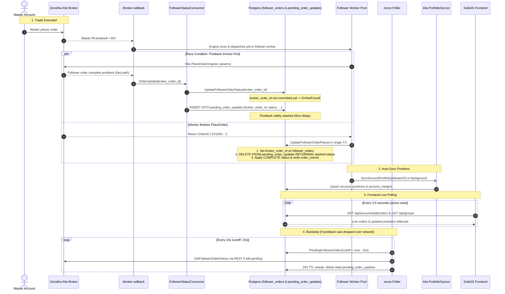

# Implementation Plan: Zero-Lag Copy-Trade Order Tracking & UI Synchronization

## Goal Description
Resolve the lag problem where copied follower orders take minutes or fail to reflect in the UI. 
The plan addresses all four latency layers using **Test-Driven Development (TDD)** and re-uses existing platform services:
1. **Postback Race Elimination (0ms delay)**: Implement **Option 2: The Stash Table Pattern** with a `pending_order_updates` staging table. Early postbacks that arrive before `PlaceOrder` commits are stashed in Postgres and immediately consumed inside `UpdateFollowerOrderPlaced`'s transaction.
2. **Reconciler Threshold Tightening**: Reduce `PendingThreshold` from 2 minutes to 15 seconds, and `PollInterval` from 30 seconds to 10 seconds, with a 24-hour TTL sweep for unmatched stashed postbacks.
3. **Automated Portfolio Sync**: Re-use `kite.PortfolioSyncer` to automatically trigger an asynchronous portfolio sync when a follower order completes, ensuring `open_positions` is instantly updated without manual button clicks.
4. **Frontend Live Updates**: Add non-disruptive adaptive polling (3-5s intervals) to `AccountOrderDetails` and `Dashboard` so orders and metrics refresh live without manual page reloads.

---

## User Review Required

> [!IMPORTANT]
> **Database Migration**: A new migration `0015_pending_order_updates.sql` will be introduced. Like all existing migrations, it is fully guarded with `IF NOT EXISTS` and applied automatically on server start via `store.Migrate`.

> [!NOTE]
> **Zero Breaking Changes**: Seam interfaces (`FollowerStatusStore`, `recon.Store`) are updated additively; existing tests continue to pass with lightweight fake method implementations.

---

## Architecture & Timing Flow



---

## Proposed Changes

### Component 1: Database Migration & Persistence

#### [NEW] `internal/store/postgres/migrations/0015_pending_order_updates.sql`
- Create table `pending_order_updates`:
  ```sql
  CREATE TABLE IF NOT EXISTS pending_order_updates (
      broker_order_id  TEXT PRIMARY KEY,
      status           TEXT NOT NULL,
      filled_quantity  INTEGER NOT NULL DEFAULT 0,
      average_price    NUMERIC(18,4),
      raw_payload      JSONB NOT NULL,
      received_at      TIMESTAMPTZ NOT NULL DEFAULT now()
  );

  CREATE INDEX IF NOT EXISTS pending_order_updates_received_at_idx
      ON pending_order_updates(received_at);
  ```

#### [MODIFY] `internal/store/postgres/store.go`
- **`StashPendingOrderUpdate`**:
  ```go
  func (s *Store) StashPendingOrderUpdate(ctx context.Context, brokerOrderID, status string, filledQty int, avgPrice decimal.Decimal, rawPayload []byte) error {
      query := `
          INSERT INTO pending_order_updates (broker_order_id, status, filled_quantity, average_price, raw_payload, received_at)
          VALUES ($1, $2, $3, $4, $5, now())
          ON CONFLICT (broker_order_id) DO UPDATE SET
              status = EXCLUDED.status,
              filled_quantity = EXCLUDED.filled_quantity,
              average_price = EXCLUDED.average_price,
              raw_payload = EXCLUDED.raw_payload,
              received_at = now();`
      _, err := s.pool.Exec(ctx, query, brokerOrderID, status, filledQty, avgPrice, rawPayload)
      return err
  }
  ```
- **`UpdateFollowerOrderPlaced`**:
  Execute inside a single atomic transaction:
  1. `UPDATE follower_orders SET broker_order_id = $2, placed_qty = $3, attempt_count = attempt_count + 1, updated_at = now() WHERE id = $1`
  2. `DELETE FROM pending_order_updates WHERE broker_order_id = $2 RETURNING status, filled_quantity, average_price, raw_payload`
  3. If a row was returned:
     - `UPDATE follower_orders SET terminal_status = $2, filled_qty = $3, average_price = $4, updated_at = now() WHERE id = $1`
     - `INSERT INTO order_events (follower_order_id, account_id, event_type, payload) VALUES ($1, $2, 'status_update', $3)`
- **`SweepPendingOrderUpdates`**:
  ```go
  func (s *Store) SweepPendingOrderUpdates(ctx context.Context, cutoff time.Time) ([]string, error) {
      rows, err := s.pool.Query(ctx, `DELETE FROM pending_order_updates WHERE received_at < $1 RETURNING broker_order_id`, cutoff)
      // returns slice of deleted broker_order_ids
  }
  ```

---

### Component 2: Ingestion & Status Consumer

#### [MODIFY] `internal/listener/listener.go`
- Add `StashPendingOrderUpdate` to `FollowerStatusStore` interface:
  ```go
  type FollowerStatusStore interface {
      UpdateFollowerOrderStatus(ctx context.Context, brokerOrderID, status string, filledQty int, averagePrice decimal.Decimal) (int64, error)
      StashPendingOrderUpdate(ctx context.Context, brokerOrderID, status string, filledQty int, averagePrice decimal.Decimal, rawPayload []byte) error
      GetFollowerOrder(ctx context.Context, id int64) (domain.FollowerOrder, error)
      AppendOrderEvent(ctx context.Context, ev domain.OrderEvent) error
  }
  ```
- Add optional `PortfolioSyncer` interface:
  ```go
  type PortfolioSyncer interface {
      SyncAccountPortfolio(ctx context.Context, accountID uuid.UUID) error
  }
  ```
- In `FollowerStatusConsumer.Handle`:
  - When `UpdateFollowerOrderStatus` returns `domain.ErrNotFound`:
    Call `c.Store.StashPendingOrderUpdate(...)` and log at `Info` level instead of dropping.
  - When `upd.Status == domain.TerminalComplete`:
    If `c.Syncer != nil`, dispatch async portfolio sync:
    ```go
    if c.Syncer != nil {
        go func(accID uuid.UUID) {
            _ = c.Syncer.SyncAccountPortfolio(context.Background(), accID)
        }(order.FollowerID)
    }
    ```

---

### Component 3: Reconciliation Poller

#### [MODIFY] `internal/recon/reconciler.go`
- Update `DefaultConfig`:
  ```go
  func DefaultConfig() Config {
      return Config{
          PollInterval:     10 * time.Second,  // was 30s
          PendingThreshold: 15 * time.Second,  // was 2m
          PollingWindow:    15 * time.Minute,
      }
  }
  ```
- Update `Store` interface to declare `SweepPendingOrderUpdates(ctx context.Context, cutoff time.Time) ([]string, error)`.
- In `Poller.RunOnce`:
  - Call `p.store.SweepPendingOrderUpdates(ctx, now.Add(-24 * time.Hour))`.
  - If any unmatched broker order IDs were deleted, raise alert:
    `p.alerter.Alert(ctx, "stale unmatched pending order updates swept", map[string]any{"count": len(unmatched), "order_ids": unmatched})`

---

### Component 4: Server Wiring

#### [MODIFY] `cmd/server/main.go`
- Inject `syncer` into `followerStatusConsumer.Syncer = syncer`.
- Ensure reconciler poller runs with `recon.DefaultConfig()` (10s interval, 15s threshold).

---

### Component 5: Frontend Reactive Polling

#### [MODIFY] `frontend/src/components/AccountOrderDetails.tsx`
- Add an interval timer when `AccountOrderDetails` is mounted:
  ```tsx
  onMount(() => {
    const timer = setInterval(() => {
      // Re-fetch active tab orders / summary without reloading skeleton
      ordersData.refetch()
    }, 3000)
    onCleanup(() => clearInterval(timer))
  })
  ```

#### [MODIFY] `frontend/src/pages/Dashboard.tsx`
- Add an interval to `Dashboard` (e.g. 5000ms) to periodically call `refetch()` on groups so status dots and follower counts stay fresh without user manual refreshes.

---

## Test-Driven Development (TDD) Plan

### 1. `internal/listener/listener_test.go`
- **Test 1**: `TestFollowerStatusConsumer_StashesWhenOrderNotFound`:
  Assert that when `UpdateFollowerOrderStatus` returns `domain.ErrNotFound`, `StashPendingOrderUpdate` is called with exact params, and no error is returned.
- **Test 2**: `TestFollowerStatusConsumer_UpdatesNormallyWhenOrderExists`:
  Assert normal path updates order and records audit log.
- **Test 3**: `TestFollowerStatusConsumer_TriggersPortfolioSyncOnComplete`:
  Assert that when status is `COMPLETE`, `PortfolioSyncer.SyncAccountPortfolio` is called for `FollowerID`.

### 2. `internal/store/postgres/store_test.go` (Integration)
- **Test 4**: `TestUpdateFollowerOrderPlaced_ConsumesStashedUpdateInSameTx`:
  1. Stash update for `F-ORDER-XYZ` with status `COMPLETE`, filledQty 50, avgPrice 105.50.
  2. Call `UpdateFollowerOrderPlaced(ctx, orderID, "F-ORDER-XYZ", 50)`.
  3. Query `follower_orders`: verify status is immediately `COMPLETE`, filled_qty is 50, avg_price is 105.50.
  4. Query `pending_order_updates`: verify `F-ORDER-XYZ` row is deleted.
  5. Query `order_events`: verify `status_update` audit row was appended.
- **Test 5**: `TestSweepPendingOrderUpdates`:
  Insert stashed row with `received_at = now() - 25 hours`, verify sweep deletes it and returns the ID.

### 3. `internal/recon/reconciler_test.go`
- **Test 6**: `TestPoller_SweepsStalePendingOrderUpdatesAndAlerts`:
  Mock `SweepPendingOrderUpdates` returning IDs; assert alerter records the event.
- **Test 7**: Verify poller picks up pending follower orders with 15s threshold.

### 4. Frontend Vitest
- **Test 8**: Run `pnpm -C frontend test --run` to verify polling cleanup and component stability.

---

## Verification Plan

### Automated Tests
```sh
# 1. Fast unit tests (listener, recon, worker, engine, httpapi)
go test -v ./internal/listener/...
go test -v ./internal/recon/...
go test ./...

# 2. Integration tests (postgres store & migrations) via Podman
export DOCKER_HOST="unix://$(podman machine inspect --format '{{.ConnectionInfo.PodmanSocket.Path}}')"
export TESTCONTAINERS_RYUK_DISABLED=true
go test -tags integration -v ./internal/store/postgres/... -run "TestUpdateFollowerOrderPlaced|TestSweepPendingOrderUpdates"

# 3. Frontend tests and build
pnpm -C frontend test --run
pnpm -C frontend build
```

### Manual Verification
1. Start Postgres and server (`make db-up`, `go run cmd/server/main.go`).
2. Simulate a rapid follower postback before placement response:
   - Verify `pending_order_updates` stashes the row.
   - Verify worker placement immediately consumes it and marks order `COMPLETE` in 0ms.
3. Open the UI Drawer: observe that order changes update live without clicking refresh.
