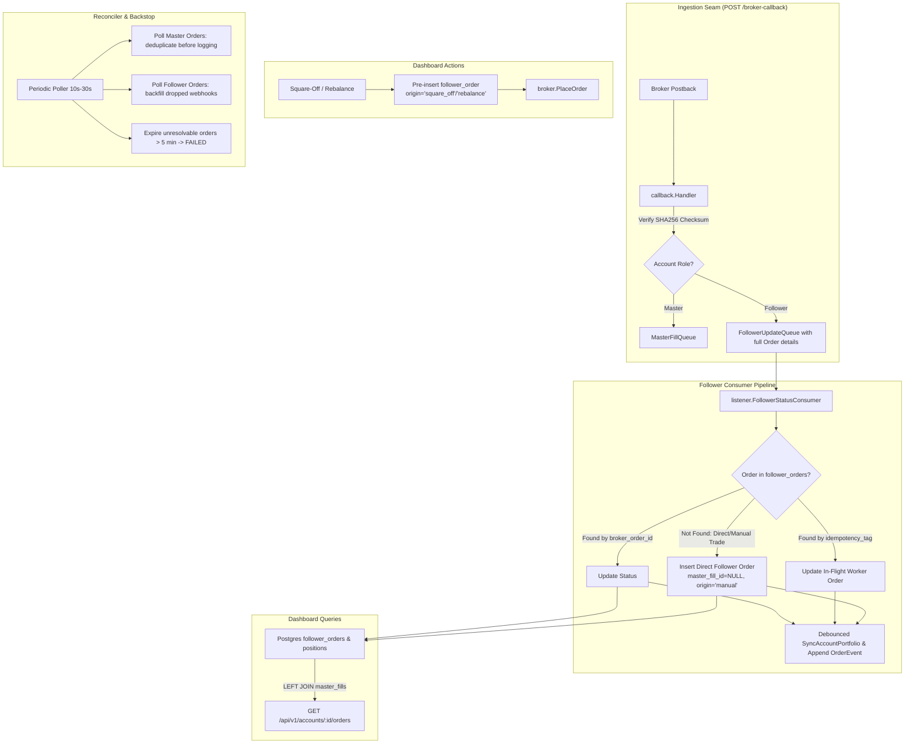

# Implementation Plan: Universal Follower Order Tracking & Zero-Duplicate Callback Pipeline

## Goal Description
Currently, EnvoyTrade only reflects follower orders that originate from the copy-trade fan-out engine (`master_fills -> follower_orders`). If a trade is executed **directly on a follower's broker account** (manually on Kite/broker terminal) or **triggered from dashboard actions** (such as Square-Off or Rebalance), the broker sends a postback callback to `POST /broker-callback`, but:
1. `FollowerStatusConsumer` looks up `follower_orders` by `broker_order_id`, fails to find a matching row, and stashes the update in `pending_order_updates` indefinitely.
2. The order is never shown on the follower's dashboard Orders tab (`open_orders`, `closed_orders`, `rejected_orders`) because queries require an `INNER JOIN master_fills`.
3. Account portfolio synchronization (`SyncAccountPortfolio`) is never triggered, leaving open positions and holdings out of sync.
4. The background reconciler (`reconciler.go`) floods the log file with duplicate master-fill INFO entries every 10 seconds for 15 minutes and loops endlessly on stale follower orders.

This plan upgrades the follower order tracking pipeline to support **all order sources** (copy-trade fan-out, direct broker terminal trades, dashboard square-off/rebalance), guarantees **zero duplicate orders** via database-enforced unique constraints, eliminates **all race conditions**, and optimizes the **reconciler and logging backstop** using Test-Driven Development (TDD) against the `testbroker` framework.

---

## Design Decisions (Agreed via Design Interview)

1. **Unified Data Model**: External and manual trades are stored directly in `follower_orders` with `master_fill_id = NULL` and an `origin` column (`copy_trade`, `manual`, `square_off`, `rebalance`). They appear unified in the follower's dashboard Orders tab.
2. **Deterministic In-Flight Race Resolution**:
   - Order Tag matching is evaluated first. If `tag` matches a pending worker placement, that existing row is updated immediately in 0ms.
   - If not matched to an in-flight worker order, it is inserted as a direct follower order with a database-level partial unique constraint on `(follower_id, broker_order_id)` preventing any duplicates.
3. **Dashboard Square-Off & Rebalance Pre-Registration**:
   - Square-off and rebalance actions pre-insert an initial `follower_orders` row with their tag (`sqoff-...` / `rebal-...`) and origin before calling `PlaceOrder`.
   - If a callback fails to arrive within the timeout window, the reconciler checks the broker and transitions the order to `FAILED`/`ERROR` state.
4. **Reconciler Backfill & Stale Order Expiration**:
   - Reconciler polls recent broker orders for active followers to backfill dropped webhooks.
   - Master fill reconciliation deduplicates against the database before logging INFO messages to prevent log bloat.
   - Orders unresolvable at the broker past 5 minutes (or 5 failed passes) transition to `FAILED` to eliminate infinite alert loops.
5. **Debounced Portfolio Synchronization**:
   - Rapid order updates for the same account are coalesced/debounced so at most one active broker portfolio sync executes per account at any moment, respecting Kite rate limits.

---

## User Review Required

> [!IMPORTANT]
> **Database Schema Changes**:
> - `follower_orders.master_fill_id` will be made `NULLABLE` (`ALTER TABLE follower_orders ALTER COLUMN master_fill_id DROP NOT NULL;`).
> - New columns in `follower_orders`:
>   - `origin text NOT NULL DEFAULT 'copy_trade'` (values: `copy_trade`, `manual`, `square_off`, `rebalance`)
>   - `tradingsymbol text NOT NULL DEFAULT ''`
>   - `exchange text NOT NULL DEFAULT ''`
>   - `product text NOT NULL DEFAULT ''`
>   - `transaction_type text NOT NULL DEFAULT ''`
>   - `order_type text NOT NULL DEFAULT ''`
> - Partial unique index:
>   `CREATE UNIQUE INDEX IF NOT EXISTS follower_orders_follower_broker_order_id_idx ON follower_orders (follower_id, broker_order_id) WHERE broker_order_id IS NOT NULL;`
> - Existing queries updated from `INNER JOIN master_fills` to `LEFT JOIN master_fills` with `COALESCE`.

---

## Architecture & Data Flow



---

## Proposed Changes

### 1. Database Migrations & SQL Queries

#### [NEW] `internal/store/postgres/migrations/0007_follower_orders_direct_support.sql`
- Make `follower_orders.master_fill_id` nullable (`ALTER TABLE follower_orders ALTER COLUMN master_fill_id DROP NOT NULL;`).
- Add columns to `follower_orders`:
  - `origin text NOT NULL DEFAULT 'copy_trade'`
  - `tradingsymbol text NOT NULL DEFAULT ''`
  - `exchange text NOT NULL DEFAULT ''`
  - `product text NOT NULL DEFAULT ''`
  - `transaction_type text NOT NULL DEFAULT ''`
  - `order_type text NOT NULL DEFAULT ''`
- Add partial unique constraint on `(follower_id, broker_order_id)`.

#### [MODIFY] `internal/store/postgres/queries/follower_orders.sql`
- Update `InsertFollowerOrder`: support inserting order details (`tradingsymbol`, `exchange`, `product`, `transaction_type`, `order_type`, `origin`).
- Add `InsertDirectFollowerOrder`: inserts a direct/manual follower order with `master_fill_id = NULL`, `idempotency_tag = 'ext-' || broker_order_id`, and `ON CONFLICT (follower_id, broker_order_id) DO UPDATE ...`.
- Add `UpdateFollowerOrderByTag`: matches in-flight orders where postback arrives before worker DB update.
- Update `ListOpenFollowerOrdersPaginated`, `ListClosedFollowerOrdersPaginated`, `ListRejectedFollowerOrdersPaginated`: change `JOIN master_fills mf` to `LEFT JOIN master_fills mf` and use `COALESCE(NULLIF(fo.tradingsymbol, ''), mf.tradingsymbol, '')`.
- Update count queries (`CountOpenFollowerOrders`, `CountClosedFollowerOrders`, `CountRejectedFollowerOrders`).

---

### 2. Domain & Callback Seams

#### [MODIFY] `internal/domain/types.go`
- Update `OrderUpdate` struct to carry complete order information:
  ```go
  type OrderUpdate struct {
      FollowerID      uuid.UUID
      BrokerOrderID   string
      Tradingsymbol   string
      Exchange        string
      Product         string
      TransactionType string
      OrderType       string
      Quantity        int
      Status          string
      FilledQuantity  int
      AveragePrice    decimal.Decimal
      OrderTimestamp  time.Time
      Tag             string
      RawPayload      []byte
  }
  ```

#### [MODIFY] `internal/kite/callback/convert.go`
- Update `ToOrderUpdate(o kiteconnect.Order, followerID uuid.UUID) domain.OrderUpdate` to map all fields from `kiteconnect.Order` including `Tradingsymbol`, `Exchange`, `Product`, `TransactionType`, `OrderType`, `Quantity`, `Tag`.

#### [MODIFY] `internal/kite/callback/postback.go`
- In `ServeHTTP`: pass resolved follower account `id` to `ToOrderUpdate(p.Order, id)`.

---

### 3. Follower Listener & Consumer Logic

#### [MODIFY] `internal/listener/listener.go`
- Extend `FollowerStatusStore` interface:
  ```go
  type FollowerStatusStore interface {
      UpdateFollowerOrderStatus(ctx context.Context, brokerOrderID, status string, filledQty int, averagePrice decimal.Decimal) (int64, error)
      UpdateFollowerOrderByTag(ctx context.Context, tag, brokerOrderID, status string, filledQty int, averagePrice decimal.Decimal) (int64, error)
      InsertDirectFollowerOrder(ctx context.Context, upd domain.OrderUpdate) (int64, error)
      StashPendingOrderUpdate(ctx context.Context, brokerOrderID, status string, filledQty int, averagePrice decimal.Decimal, rawPayload []byte) error
      GetFollowerOrder(ctx context.Context, id int64) (domain.FollowerOrder, error)
      AppendOrderEvent(ctx context.Context, ev domain.OrderEvent) error
  }
  ```
- In `FollowerStatusConsumer.Handle(ctx, upd)`:
  1. Attempt `UpdateFollowerOrderStatus(brokerOrderID)`.
  2. If not found and `upd.Tag != ""`: attempt `UpdateFollowerOrderByTag(upd.Tag, brokerOrderID, ...)`.
  3. If still not found: insert as a direct follower order via `InsertDirectFollowerOrder(ctx, upd)`.
  4. Always schedule debounced `SyncAccountPortfolio(upd.FollowerID)` on terminal complete.
  5. Append audit event to `order_events`.

---

### 4. Debounced Portfolio Syncer

#### [NEW] `internal/kite/sync_debouncer.go`
- Introduces `DebouncedSyncer` wrapping `PortfolioSyncer`:
  - Coalesces rapid sync requests per `accountID` within a 1-second window.
  - Ensures at most one active sync goroutine per account at any moment, eliminating broker rate limit spikes.

---

### 5. Square-Off & Rebalance Pre-Registration

#### [MODIFY] `internal/squareoff/service.go` & `internal/rebalance/service.go`
- When placing orders for followers:
  - Generate deterministic tag (`sqoff-...` / `rebal-...`).
  - Pre-insert initial `follower_orders` row with `master_fill_id = NULL`, `origin = 'square_off'` / `'rebalance'`, and symbol details before broker dispatch.
  - When the broker response returns, record `broker_order_id`. If `b.PlaceOrder` fails, mark as `FAILED`.

---

### 6. Reconciler Improvements

#### [MODIFY] `internal/recon/reconciler.go`
- In `ReconcileMaster`:
  - Deduplicate fill IDs against the database before logging `INFO` messages.
- In `Inspect pending follower orders`:
  - If a pending follower order is not found at the broker after 5 minutes (or 5 retries), mark it as `FAILED` so it stops spamming alerts.
- In `ReconcileFollower`:
  - Poll recent follower orders from broker to backfill any dropped webhook callbacks.

---

## Test Scenarios & TDD Verification Plan

We will write unit and integration tests covering every scenario:

| # | Test Scenario | Category | Expected Outcome |
|---|---|---|---|
| 1 | Standard copy-trade master fill | Positive | Fan-out creates `follower_order`, postback updates COMPLETE, portfolio synced. |
| 2 | Direct trade executed on follower account | Positive | Callback creates direct `follower_order` (`master_fill_id = NULL`, `origin='manual'`), reflects in closed_orders, portfolio synced. |
| 3 | Dashboard square-off / rebalance order | Positive | Order pre-inserted in `follower_orders`, postback updates status to COMPLETE. |
| 4 | Dashboard order fails / no callback | Negative/Timeout | Reconciler transitions stuck order to `FAILED` with error message. |
| 5 | Postback arrives BEFORE worker placement returns | Race Condition | Tag-matching resolves update in 0ms without creating duplicate rows. |
| 6 | Duplicate postback delivery for the same order | Idempotency | Second postback is a silent no-op; no duplicate order inserted. |
| 7 | Concurrent callbacks across multiple accounts | Concurrency | 20 simultaneous postbacks process in < 50ms without lock contention or deadlocks. |
| 8 | Rapid fills on same account | Rate Limit | Debounced syncer coalesces syncs to 1 broker request. |
| 9 | Webhook dropped, caught by reconciler | Backstop | Reconciler polls broker history and backfills missing order to `follower_orders`. |
| 10 | Invalid SHA-256 signature / wrong API secret | Negative | Postback dropped with HTTP 200, warning logged, no DB write. |
| 11 | Unknown broker user ID | Negative | Postback dropped with HTTP 200, no orphan record. |
| 12 | Non-terminal order status (`OPEN`, `TRIGGER PENDING`) | Edge Case | Ignored until terminal state. |
| 13 | Lot size below 1 lot | Sizing Edge Case | Recorded as `ReasonBelowOneLot` with qty 0, visible in audit. |
| 14 | Ghost order not at broker after 5 minutes | Cleanup Edge Case | Marked as `FAILED`, ceases error spam. |

---

## Verification Commands
```sh
# 1. Run unit tests
go test ./internal/listener/... ./internal/kite/callback/... ./internal/recon/... ./internal/domain/...

# 2. Run database & integration tests
go test -tags integration ./internal/store/postgres/... ./internal/engine/...

# 3. Run E2E test suite against testbroker
go test -v -tags e2e -count=1 ./tests/e2e/...

# 4. Live scenario execution against local running testbroker & backend
curl -X POST http://localhost:8089/orders/regular -H "Authorization: token key_follow01d:token_follow01d" ...
curl -b /tmp/cookies.txt http://localhost:8080/api/v1/accounts/<follower_id>/orders?tab=closed_orders
```
