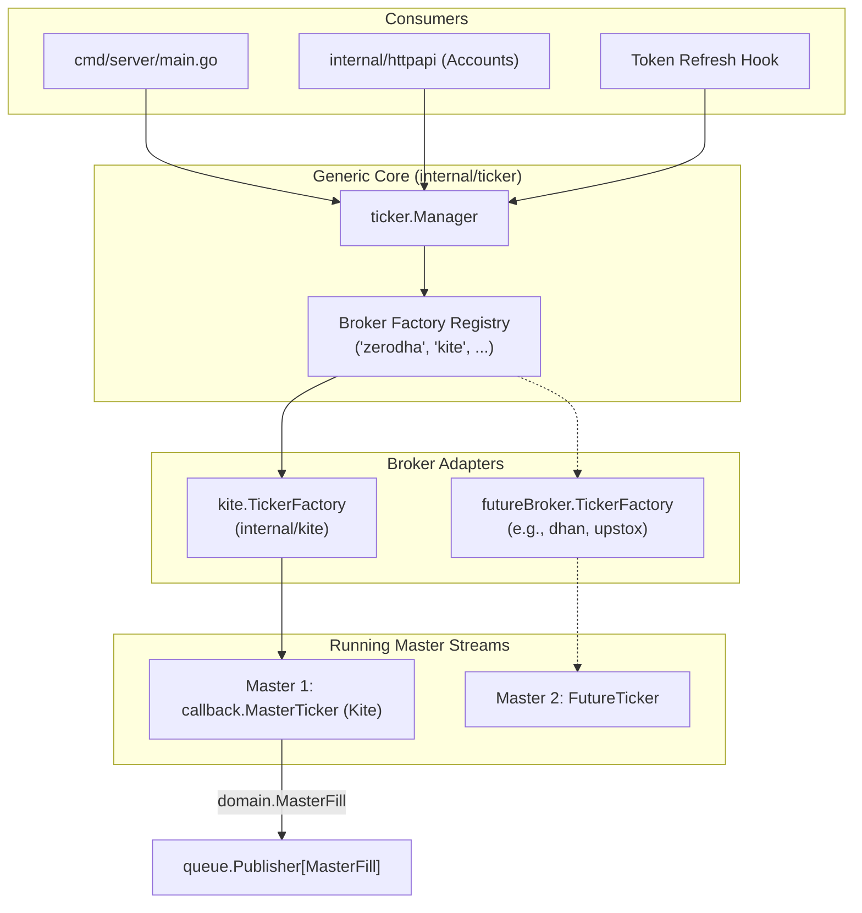

# Generic Multi-Broker TickerManager Implementation Plan

This document outlines the architecture, design, and step-by-step TDD implementation plan to introduce a broker-agnostic `ticker.Manager` in `internal/ticker`, enabling dynamic master order WebSockets across multiple brokers (Zerodha Kite, Upstox, Dhan, etc.) while preventing regressions.

---

## 1. Goal Description

In EnvoyTrade, master account fills are streamed over broker WebSockets to enable sub-second fan-out copy-trading to follower accounts.

Currently, [`internal/kite.TickerManager`](file:///Users/msp/MSP/Projects/EnvoyTrade/internal/kite/ticker_manager.go#L36) hardcodes Zerodha Kite Connect credentials and websocket clients (`ws.NewConn`, `callback.NewMasterTicker`). 

To support multiple brokers and future broker shifts:
1. **Extract manager logic** into a generic, broker-agnostic package: [`internal/ticker`](file:///Users/msp/MSP/Projects/EnvoyTrade/internal/ticker).
2. **Define a clean broker seam**: [`Ticker`](file:///Users/msp/MSP/Projects/EnvoyTrade/internal/ticker/manager.go) (`Start`, `Stop`) and [`Factory`](file:///Users/msp/MSP/Projects/EnvoyTrade/internal/ticker/manager.go) (`CreateTicker`).
3. **Encapsulate Kite-specific details**: Move Kite ticker instantiation into a pluggable `kite.TickerFactory` in [`internal/kite`](file:///Users/msp/MSP/Projects/EnvoyTrade/internal/kite).
4. **Follow Test-Driven Development (TDD)**: Guarantee zero regressions in lifecycle transitions, reconnection catch-up hooks, and goroutine leak prevention.

---

## 2. Architecture & Data Flow



---

## 3. Detailed Component Design

### 3.1 Generic Package (`internal/ticker`)

The generic manager owns the concurrency, lifecycle, and store interaction without knowing broker protocols:

```go
package ticker

import (
	"context"
	"log/slog"
	"strings"
	"sync"

	"envoytrade/internal/domain"
	"github.com/google/uuid"
)

// Ticker represents an active master order stream.
type Ticker interface {
	Start(ctx context.Context)
	Stop() error
}

// Factory creates a Ticker instance for a master account given credentials and catch-up hook.
type Factory interface {
	CreateTicker(ctx context.Context, masterID uuid.UUID, auth domain.AccountAuthInfo, catchUp func(context.Context) error) (Ticker, error)
}

// Store declares persistence methods needed by Manager.
type Store interface {
	Groups(ctx context.Context) ([]domain.GroupSummary, error)
	AccountAuthInfo(ctx context.Context, id uuid.UUID) (domain.AccountAuthInfo, error)
	MasterActive(ctx context.Context, masterID uuid.UUID) (bool, error)
}

// Reconciler declares scoped reconciliation methods executed on reconnect.
type Reconciler interface {
	ReconcileMaster(ctx context.Context, masterID uuid.UUID) error
}
```

#### Lifecycle Management
- **`StartMaster(ctx, masterID)`**:
  1. Checks if master is already running (safe idempotent no-op).
  2. Verifies master is active via `Store.MasterActive`.
  3. Loads `authInfo` from `Store.AccountAuthInfo`.
  4. Resolves factory by `strings.ToLower(authInfo.Broker)` (defaulting to `"zerodha"` if empty).
  5. Assembles `catchUp` callback to trigger `Reconciler.ReconcileMaster(ctx, masterID)`.
  6. Calls `factory.CreateTicker`. If credentials are missing, skips gracefully.
  7. Stores `managedTicker` and spawns `go ticker.Start(ctx)`.
- **`StopMaster(masterID)`**: Cancels context, closes ticker via `Stop()`, and deletes from map.
- **`RestartMaster(ctx, masterID)`**: Calls `StopMaster` then `StartMaster`.
- **`SyncActiveMasters(ctx)`**: Iterates all groups from `Store.Groups` and calls `StartMaster`.
- **`Shutdown()`**: Stops and closes all active master tickers concurrently.

---

### 3.2 Kite Factory Adapter (`internal/kite/ticker_factory.go`)

Adapts Zerodha Kite Connect WebSocket client (`ws.Conn` and `callback.MasterTicker`) to `ticker.Factory`:

```go
package kite

import (
	"context"
	"log/slog"

	"envoytrade/internal/domain"
	"envoytrade/internal/kite/callback"
	"envoytrade/internal/kite/ws"
	"envoytrade/internal/queue"
	"envoytrade/internal/ticker"

	"github.com/google/uuid"
)

type TickerFactory struct {
	queue     queue.Publisher[domain.MasterFill]
	logger    *slog.Logger
	wsRootURL string
}

func NewTickerFactory(queue queue.Publisher[domain.MasterFill], logger *slog.Logger) *TickerFactory {
	return &TickerFactory{queue: queue, logger: logger}
}

func (f *TickerFactory) SetWSRootURL(rootURL string) {
	f.wsRootURL = rootURL
}

func (f *TickerFactory) CreateTicker(
	ctx context.Context,
	masterID uuid.UUID,
	auth domain.AccountAuthInfo,
	catchUp func(context.Context) error,
) (ticker.Ticker, error) {
	if auth.ApiKey == "" || auth.AccessToken == "" {
		return nil, nil // unconfigured/missing token, skip
	}

	conn := ws.NewConn(ws.Config{
		APIKey:      auth.ApiKey,
		AccessToken: auth.AccessToken,
		RootURL:     f.wsRootURL,
	}, f.logger)

	tickerLogger := f.log().With("component", "master_ticker", "master_id", masterID)
	masterTicker := callback.NewMasterTicker(conn, masterID, f.queue, tickerLogger)
	if catchUp != nil {
		masterTicker.SetCatchUpHook(catchUp)
	}

	return masterTicker, nil
}
```

Notice that `callback.MasterTicker` already satisfies `ticker.Ticker` because it implements:
- `Start(ctx context.Context)`
- `Stop() error`

---

## 4. Test-Driven Development (TDD) Implementation Steps

### Step 1: Write Unit Tests First (`internal/ticker/manager_test.go`)
Before writing implementation code in `internal/ticker`, write comprehensive tests asserting:
1. **Multi-broker routing**: Master with `Broker: "kite"` routes to Kite factory; master with `Broker: "broker_b"` routes to custom mock factory.
2. **Duplicate start idempotency**: Repeated `StartMaster` calls do not spawn second instances.
3. **Inactive skipping**: Inactive masters (`MasterActive == false`) do not start tickers.
4. **Missing credentials skipping**: Factory returning `nil, nil` is handled without error.
5. **Unknown broker handling**: Account specifying unknown broker returns an error and does not start a ticker.
6. **Token restart**: `RestartMaster` stops the old instance and boots a new one with refreshed credentials.
7. **Sync active masters**: `SyncActiveMasters` scans all groups and starts tickers for active masters.
8. **Catch-up hook propagation**: Reconnection hook calls `Reconciler.ReconcileMaster` with matching `masterID`.
9. **Goroutine clean shutdown**: Assert with `go.uber.org/goleak` that `Shutdown()` leaves no hanging goroutines.

### Step 2: Implement `internal/ticker/manager.go`
Implement `ticker.Manager` and run `go test ./internal/ticker/...` until all tests pass.

### Step 3: Implement `internal/kite/ticker_factory.go`
Create the Kite adapter and update `internal/kite/ticker_manager.go` to wrap `ticker.NewManager` + `kite.TickerFactory` for 100% backwards compatibility with existing `kite_test` tests.

### Step 4: Wire `cmd/server/main.go`
Instantiate `ticker.NewManager`, register `kite.NewTickerFactory` under `"kite"` and `"zerodha"`, and pass the manager into `httpapi.WithTickerManager`.

### Step 5: Verification & Regressions Check
Run full test suite:
```sh
go test ./...
go vet ./...
```

---

## 5. Verification Plan

| Check | Tool / Command | Expected Result |
|---|---|---|
| New Generic Manager Tests | `go test -v ./internal/ticker/...` | Pass, zero leaks verified with `goleak` |
| Backward Compatibility | `go test -v ./internal/kite/... -run TestTickerManager` | Pass |
| HTTP API Compatibility | `go test -v ./internal/httpapi/...` | Pass |
| Whole Repo Suite | `go test ./...` | All packages pass cleanly |
| Static Analysis | `go vet ./...` | Zero vet issues |
