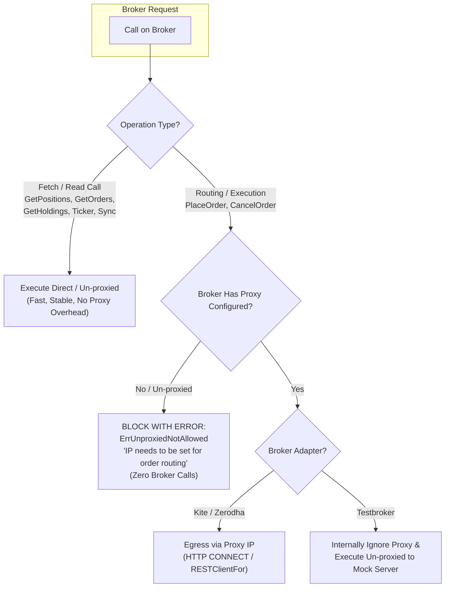

# Plan: Scoped Static IP Enforcement for Order Routing & Execution

## Goal Description
Enforce dedicated static proxy egress strictly scoped to **order routing and execution** (order placement and cancellation), while keeping **fetch and read operations un-proxied**.
- **Order Execution & Routing** (`PlaceOrder`, `CancelOrder`): Must go **strictly via proxy**. Any un-proxied call attempting order routing/execution must be **blocked immediately with an error** before any request touches the broker.
- **Fetch & Read Operations** (`GetOrders`, `GetOrderHistory`, `GetPositions`, `GetHoldings`, `GetUserMargins`, WebSocket ticker stream, headless login): **Can stay un-proxied**, avoiding unnecessary bandwidth usage, proxy socket exhaustion, and WebSocket connection stability issues.
- **Master Accounts**:
  - Setting an IP in the database is optional.
  - Can freely perform read-only fetch calls (viewing portfolio, streaming fills via ticker, reconciler checks) without an IP.
  - If a Master without an IP attempts an **order routing or execution operation** (such as Square-Off or Rebalance order placement/cancellation), it **must be stopped immediately with an error** that an IP needs to be set for such operation, **without sending any request to the broker**.
- **Follower Accounts**:
  - An IP address is **mandatory**.
  - All follower order placement (copy-trade fanout, square-off, rebalance) must egress through the account's dedicated proxy. Un-proxied order execution is strictly blocked.
- **Mock Broker (`testbroker`) Parity**:
  - Follows the exact same interface and validation as Kite: accepts the proxy configuration object, enforces that an IP must be present for execution, blocks un-proxied execution calls, and internally executes the network call un-proxied against the local mock server (`http://localhost:8089`).



---

## Call Classification & Summary Matrix

Every broker-related call across the platform is segregated into **Order Routing/Execution** vs **Fetch/Read**:

| # | Operation | Target Method | Category | Proxy Requirement | Error if Un-proxied? |
|---|---|---|---|:---:|:---:|
| 1 | **Copy-Trade Follower Placement** | `b.PlaceOrder` | **Order Routing / Execution** | **PROXIED ONLY** | 🛑 **BLOCKED** (`ErrUnproxiedNotAllowed`) |
| 2 | **Square-Off Order Placement** | `b.PlaceOrder` | **Order Routing / Execution** | **PROXIED ONLY** | 🛑 **BLOCKED** (`ErrUnproxiedNotAllowed`) |
| 3 | **Square-Off Order Cancellation** | `b.CancelOrder` | **Order Routing / Execution** | **PROXIED ONLY** | 🛑 **BLOCKED** (`ErrUnproxiedNotAllowed`) |
| 4 | **Rebalance Order Placement** | `b.PlaceOrder` | **Order Routing / Execution** | **PROXIED ONLY** | 🛑 **BLOCKED** (`ErrUnproxiedNotAllowed`) |
| 5 | **Rebalance Order Cancellation** | `b.CancelOrder` | **Order Routing / Execution** | **PROXIED ONLY** | 🛑 **BLOCKED** (`ErrUnproxiedNotAllowed`) |
| 6 | **Reconciler Master Poller** | `kc.GetOrders` | Fetch / Read | Un-proxied OK | Allowed |
| 7 | **Reconciler Stuck Order History** | `kc.GetOrderHistory` | Fetch / Read | Un-proxied OK | Allowed |
| 8 | **Master WebSocket Ticker Stream** | `ws.Conn` (`wss://ws.kite.trade`) | Fetch / Read (Stream) | Un-proxied OK | Allowed |
| 9 | **Portfolio Syncer (Holdings)** | `kc.GetHoldings` | Fetch / Read | Un-proxied OK | Allowed |
| 10 | **Portfolio Syncer (Positions)** | `kc.GetPositions` | Fetch / Read | Un-proxied OK | Allowed |
| 11 | **Portfolio Syncer (Margins)** | `kc.GetUserMargins` | Fetch / Read | Un-proxied OK | Allowed |
| 12 | **Headless Daily Login** | `POST kite.zerodha.com/...` | Auth / Fetch | Un-proxied OK | Allowed |
| 13 | **Square-Off / Rebalance Position Reads** | `b.GetPositions`, `b.GetOpenOrders` | Fetch / Read | Un-proxied OK | Allowed |

---

## User Review Required

> [!IMPORTANT]
> **Clear Segregation of Concerns**:
> - Read-only actions (dashboard refreshes, polling order states, reading margins, ticker listening) execute with minimum latency directly from the server.
> - Mutating order actions (`PlaceOrder`, `CancelOrder`) are guarded at the broker level: if an account does not have a valid proxy configured, mutating calls are **physically blocked** before reaching any network socket.

---

## Proposed Changes

### 1. Domain Sentinels
#### [MODIFY] [`internal/domain/types.go`](file:///Users/msp/MSP/Projects/EnvoyTrade/internal/domain/types.go)
- Add sentinels for proxy enforcement:
  ```go
  // ErrUnproxiedNotAllowed is returned when an order routing or execution operation
  // is attempted on a broker that is not configured with a static proxy.
  var ErrUnproxiedNotAllowed = errors.New("domain: unproxied order routing is not allowed: IP needs to be set for this operation")
  var ErrIPRequired = errors.New("domain: IP address is required for follower accounts")
  ```

---

### 2. Kite Broker Guard & Proxy Egress
#### [MODIFY] [`internal/kite/broker.go`](file:///Users/msp/MSP/Projects/EnvoyTrade/internal/kite/broker.go)
- Update `Broker` struct to track whether proxying is active:
  ```go
  type Broker struct {
      api     API
      proxied bool
  }

  func NewBroker(api API, proxied bool) *Broker {
      return &Broker{api: api, proxied: proxied}
  }
  ```
- Guard mutating calls:
  ```go
  func (b *Broker) PlaceOrder(ctx context.Context, variety string, params broker.OrderParams) (broker.OrderResponse, error) {
      if !b.proxied {
          return broker.OrderResponse{}, fmt.Errorf("kite place order: %w", domain.ErrUnproxiedNotAllowed)
      }
      ...
  }

  func (b *Broker) CancelOrder(ctx context.Context, variety, orderID string) (broker.OrderResponse, error) {
      if !b.proxied {
          return broker.OrderResponse{}, fmt.Errorf("kite cancel order: %w", domain.ErrUnproxiedNotAllowed)
      }
      ...
  }
  ```
- Non-mutating calls (`GetPositions`, `GetOpenOrders`, `GetOrders`, `GetHoldings`, `GetUserMargins`) proceed directly to `b.api` without requiring `b.proxied`.

#### [MODIFY] [`internal/kite/proxy.go`](file:///Users/msp/MSP/Projects/EnvoyTrade/internal/kite/proxy.go)
- Update `NewLiveBroker(apiKey, accessToken string, proxyCfg *ProxyConfig) (*Broker, error)`:
  - If `proxyCfg != nil && proxyCfg.Host != ""`:
    - Create proxy HTTP client via `RESTClientFor(*proxyCfg)`.
    - Set on Kite client: `kc.SetHTTPClient(httpClient)`.
    - Return `NewBroker(kc, true)`.
  - If `proxyCfg == nil` or `proxyCfg.Host == ""`:
    - Return `NewBroker(kc, false)`.
    - (This allows read calls to function un-proxied, while mutating calls are blocked).

---

### 3. Mock Broker (`testbroker`) Parity
#### [MODIFY] [`internal/testbroker/broker.go`](file:///Users/msp/MSP/Projects/EnvoyTrade/internal/testbroker/broker.go)
- Add `ProxyConfig` type matching `kite.ProxyConfig`:
  ```go
  type ProxyConfig struct {
      Scheme       string
      Host         string
      Port         int
      ClientID     string
      ClientSecret string
  }
  ```
- Add `proxied bool` to `testbroker.Broker`:
  ```go
  type Broker struct {
      client  *sdk.Client
      baseURI string
      proxied bool
  }
  ```
- Guard mutating calls in `testbroker`:
  ```go
  func (b *Broker) PlaceOrder(...) (broker.OrderResponse, error) {
      if !b.proxied {
          return broker.OrderResponse{}, fmt.Errorf("testbroker place order: %w", domain.ErrUnproxiedNotAllowed)
      }
      return b.client.PlaceOrder(...)
  }

  func (b *Broker) CancelOrder(...) (broker.OrderResponse, error) {
      if !b.proxied {
          return broker.OrderResponse{}, fmt.Errorf("testbroker cancel order: %w", domain.ErrUnproxiedNotAllowed)
      }
      return b.client.CancelOrder(...)
  }
  ```
- Update `Factory.CreateBroker(ctx, account)`:
  - If `account.ProxyHost != ""`: builds `proxyCfg` and sets `proxied = true`.
  - Internally connects un-proxied to `testbroker` mock server, satisfying interface and execution parity.

---

### 4. Broker Resolution & Server Egress
#### [MODIFY] [`cmd/server/main.go`](file:///Users/msp/MSP/Projects/EnvoyTrade/cmd/server/main.go)
1. **`serverBrokerResolver.ResolveBroker(ctx, accountID)`**:
   - Check role:
     - If `role == "follower"`:
       - If `authInfo.IPAddress == ""`: return `nil, fmt.Errorf("follower account %s: %w", accountID, domain.ErrIPRequired)`.
       - Look up proxy IP via `r.store.ProxyIPByAddress(ctx, authInfo.IPAddress)`. If error, return error immediately (fail-fast, zero silent fallback).
       - Populate `acc.ProxyHost`, `acc.ProxyPort`, `acc.ProxyUsername`, `acc.ProxyPassword`.
     - If `role == "master"`:
       - If `authInfo.IPAddress != ""`:
         - Look up proxy IP via `r.store.ProxyIPByAddress(ctx, authInfo.IPAddress)`. If error, return error immediately.
         - Populate proxy credentials so `PlaceOrder` / `CancelOrder` will be proxied.
       - If `authInfo.IPAddress == ""`:
         - Do not populate proxy credentials; returns a broker with `proxied: false`. Fetch calls will succeed, but any `PlaceOrder`/`CancelOrder` will block with `ErrUnproxiedNotAllowed`.
   - Call `r.registry.Create(ctx, acc)`.
2. **`registerFollowers` & Dynamic Worker Pool**:
   - In `registerFollowers`, if a follower fails to resolve, log error and skip registration (never substitute `fake.Broker{}`).
   - Provide dynamic registrar so when a follower's IP is patched via `PATCH /api/v1/accounts/{id}` or a follower is attached to a group (`POST /api/v1/groups/{id}/followers`), the worker pool registers the newly proxied broker.

---

### 5. Fetch Calls Clean-up (Un-proxied by Design)
- **`serverMasterReader.GetMasterOrders`**:
  - Keep as a clean direct REST call to `kc.GetOrders()` (documented explicitly as an un-proxied fetch call).
- **`serverFollowerReader.GetFollowerOrderHistory`**:
  - Keep as a clean direct REST call to `kc.GetOrderHistory()` (documented explicitly as an un-proxied fetch call).
- **`kite.TickerFactory.CreateTicker` & `ws.Conn`**:
  - Keep as a direct WebSocket connection to `wss://ws.kite.trade` (documented explicitly as an un-proxied fetch/listen call).
- **`PortfolioSyncer.SyncAccountPortfolio`**:
  - Fetch calls for holdings, positions, margins remain un-proxied.

---

### 6. Test Data & Seed Updates
#### [MODIFY] [`scripts/seed_test_data.sql`](file:///Users/msp/MSP/Projects/EnvoyTrade/scripts/seed_test_data.sql)
- Seed mock proxy IPs into `proxy_ips`.
- Assign proxy IPs to the 8 follower accounts (`FOLLOW01A`–`FOLLOW02D`) and to `MASTER01` so copy-trading and square-off / rebalance execution tests function cleanly.
- Keep `MASTER02` without an IP to serve as a test case for a Master without an IP.

---

## Verification Plan

### Automated Tests
```sh
# Run all unit tests
go test ./...

# Run broker and kite specific tests
go test ./internal/broker/... -v
go test ./internal/kite/... -v
go test ./internal/testbroker/... -v

# Run square-off and rebalance tests
go test ./internal/squareoff/... -v
go test ./internal/rebalance/... -v

# Run server and HTTP API tests
go test ./cmd/server/... -v
go test ./internal/httpapi/... -v
```

### Specific Test Cases to Implement
1. **Unproxied Order Execution Blocked**:
   - Create unproxied `kite.Broker` (`NewBroker(fakeAPI, false)`).
   - Verify `b.GetPositions()` and `b.GetOpenOrders()` succeed without error.
   - Verify `b.PlaceOrder()` returns `ErrUnproxiedNotAllowed`.
   - Verify `b.CancelOrder()` returns `ErrUnproxiedNotAllowed`.
   - Verify fake API recorded 0 order placement/cancellation calls.
2. **Proxied Order Execution Allowed**:
   - Create proxied `kite.Broker` (`NewBroker(fakeAPI, true)`).
   - Verify `b.PlaceOrder()` and `b.CancelOrder()` succeed and delegate to underlying API.
3. **Master without IP**:
   - Square-off or rebalance order execution on Master without IP returns `ErrUnproxiedNotAllowed` without sending any orders.
   - Read-only queries (fetching positions/holdings) succeed.
4. **Follower without IP**:
   - Attempting to resolve follower broker without an IP returns `ErrIPRequired`.
   - Cannot place copy-trade orders.
5. **Testbroker Parity**:
   - Testbroker with proxy config allows `PlaceOrder` / `CancelOrder`.
   - Testbroker without proxy config blocks `PlaceOrder` / `CancelOrder` with `ErrUnproxiedNotAllowed`.
