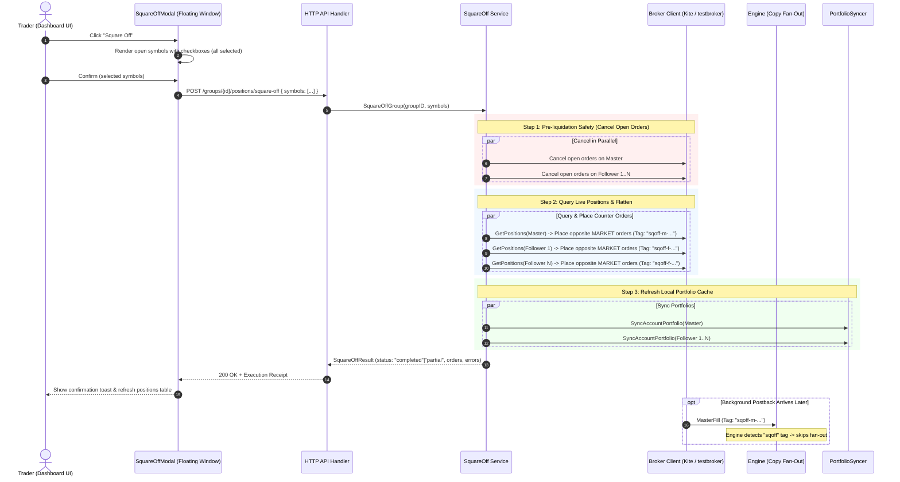

# Implementation Plan: F&O Square-Off Support in EnvoyTrade

## Goal Description

Implement institutional-grade **Square-Off** functionality in EnvoyTrade for F&O derivative trading on Zerodha Kite and the mock broker (`testbroker`):
1. **Cluster / Group-Level Square-Off**: `POST /api/v1/groups/{group_id}/positions/square-off` flattens open positions for the Master and all linked followers in that trading group.
2. **Account-Level Square-Off**: `POST /api/v1/accounts/{account_id}/positions/square-off` flattens open positions strictly for the targeted account (e.g. single follower exit), leaving master and peer followers untouched.
3. **Selective Symbol Targeting**: Support squaring off all open positions by default, or an explicit subset of symbols selected via a floating modal UI with checkboxes.
4. **Auto-Cancel Open Orders First**: Before firing market counter-orders, automatically cancel all pending/open limit orders on target accounts to prevent accidental re-entries during liquidation.
5. **Parallel Synchronous Execution with Best-Effort Resilience**: Execute broker operations concurrently across accounts, collect any individual broker errors without aborting peer accounts, and return `200 OK` with a detailed receipt (`status: "completed"` or `"partial"`).
6. **Postback Loop Decoupling**: Tag square-off orders (`sqoff-...`) so `engine.HandleMasterFill` ignores master exit fills and skips fan-out, eliminating double-order and naked-short risks.
7. **TDD & Integration Testing**: Comprehensive test suite using the seeded `testbroker` accounts (`MASTER01`, `FOLLOW01A`).

---

## Architectural Decisions (from Design Interview)

| Area | Decision | Rationale |
|---|---|---|
| **API Endpoints** | Group-level: `POST /api/v1/groups/{group_id}/positions/square-off`<br/>Account-level: `POST /api/v1/accounts/{account_id}/positions/square-off` | Clear separation between cluster operations and single-account exits; no confusing side-effects. |
| **Backward Compatibility** | None needed | Clean RESTful slate; legacy `POST /actions` is deprecated/replaced. |
| **Symbol Scope** | Selective via `symbols: []string` in request body. Empty = all open positions. | Allows closing specific contracts (e.g. weekly expiry roll) or full liquidation. |
| **UI Experience** | Floating modal with symbol checkboxes (all checked by default). | Operator sees exact open contracts and can uncheck any position they wish to keep open. |
| **Open Order Safety** | Auto-cancel pending limit orders prior to placing square-off market orders. | Critical for F&O: prevents resting limit orders from filling seconds after square-off and creating orphan positions. |
| **Execution Model** | Synchronous parallel dispatch across accounts. | Fast (<500ms for typical clusters), deterministic, returns immediate receipt with order IDs. |
| **Failure Handling** | Best-effort resilience; continue across remaining followers, return `status: "partial"` with errors. | Never leave remaining followers exposed just because one account experienced a broker glitch. |
| **Copy Pipeline Decoupling** | Tag orders with `sqoff-...`; `engine.HandleMasterFill` ignores them. | Prevents master square-off fills from re-triggering copy fan-out onto already-flattened followers. |

---

## Execution Flow



---

## API Specification

### 1. Group Square-Off
`POST /api/v1/groups/{group_id}/positions/square-off`

**Request Body** (optional):
```json
{
  "symbols": ["CRUDEOIL17SEP26C10600", "CRUDEOIL17SEP26C10700"]
}
```
*If `symbols` is omitted or empty, all open positions in the cluster are squared off.*

**Response** (`200 OK`):
```json
{
  "action": "square_off",
  "status": "completed",
  "group_id": "f6e70723-b904-4427-83ee-a85771dee2e4",
  "master_id": "f6e70723-b904-4427-83ee-a85771dee2e4",
  "followers_affected": 4,
  "cancelled_orders": 2,
  "positions_squared_off": 8,
  "orders": [
    {
      "account_id": "f6e70723-b904-4427-83ee-a85771dee2e4",
      "role": "master",
      "broker_order_id": "TB_ORD_101",
      "exchange": "MCX",
      "tradingsymbol": "CRUDEOIL17SEP26C10700",
      "product": "CNC",
      "side": "BUY",
      "quantity": 100,
      "status": "placed"
    }
  ],
  "errors": []
}
```

### 2. Single Account Square-Off
`POST /api/v1/accounts/{account_id}/positions/square-off`

**Request Body** (optional):
```json
{
  "symbols": ["NIFTY26OCTFUT"]
}
```

**Response** (`200 OK`):
```json
{
  "action": "square_off",
  "status": "completed",
  "account_id": "a5183e89-6cb2-4d32-91a2-6dc525570185",
  "role": "follower",
  "followers_affected": 1,
  "cancelled_orders": 0,
  "positions_squared_off": 1,
  "orders": [
    {
      "account_id": "a5183e89-6cb2-4d32-91a2-6dc525570185",
      "role": "follower",
      "broker_order_id": "TB_ORD_102",
      "exchange": "NFO",
      "tradingsymbol": "NIFTY26OCTFUT",
      "product": "NRML",
      "side": "SELL",
      "quantity": 75,
      "status": "placed"
    }
  ],
  "errors": []
}
```

---

## Proposed Changes

### Component 1: Broker Abstraction (`internal/broker`)

Extend `broker.Broker` to support reading positions and cancelling orders across all implementations:

#### [MODIFY] [`internal/broker/types.go`](file:///Users/msp/MSP/Projects/EnvoyTrade/internal/broker/types.go)
- Add `broker.Position` struct:
  ```go
  type Position struct {
      Exchange        string  `json:"exchange"`
      Tradingsymbol   string  `json:"tradingsymbol"`
      Product         string  `json:"product"`
      Quantity        int     `json:"quantity"` // net quantity
      AveragePrice    float64 `json:"average_price"`
      LastPrice       float64 `json:"last_price"`
      M2M             float64 `json:"m2m"`
      PnL             float64 `json:"pnl"`
  }
  ```
- Add `broker.Order` struct for open order cancellation:
  ```go
  type Order struct {
      OrderID       string `json:"order_id"`
      Exchange      string `json:"exchange"`
      Tradingsymbol string `json:"tradingsymbol"`
      Status        string `json:"status"`
  }
  ```

#### [MODIFY] [`internal/broker/interface.go`](file:///Users/msp/MSP/Projects/EnvoyTrade/internal/broker/interface.go)
- Extend `Broker` interface:
  ```go
  type Broker interface {
      PlaceOrder(ctx context.Context, variety string, params OrderParams) (OrderResponse, error)
      GetPositions(ctx context.Context) ([]Position, error)
      GetOpenOrders(ctx context.Context) ([]Order, error)
      CancelOrder(ctx context.Context, variety, orderID string) (OrderResponse, error)
  }
  ```

#### [MODIFY] [`internal/kite/broker.go`](file:///Users/msp/MSP/Projects/EnvoyTrade/internal/kite/broker.go)
- Implement `GetPositions`, `GetOpenOrders`, and `CancelOrder` wrapping `*kiteconnect.Client`.

#### [MODIFY] [`internal/testbroker/broker.go`](file:///Users/msp/MSP/Projects/EnvoyTrade/internal/testbroker/broker.go)
- Implement `GetPositions`, `GetOpenOrders`, and `CancelOrder` wrapping `*sdk.Client`.

#### [MODIFY] [`internal/kite/fake/fake.go`](file:///Users/msp/MSP/Projects/EnvoyTrade/internal/kite/fake/fake.go)
- Implement `GetPositions`, `GetOpenOrders`, and `CancelOrder` backed by in-memory fields.

---

### Component 2: Domain Models & Engine Decoupling (`internal/domain`, `internal/engine`)

#### [MODIFY] [`internal/domain/types.go`](file:///Users/msp/MSP/Projects/EnvoyTrade/internal/domain/types.go)
- Add `Tag string` field to `domain.MasterFill`.
- Add `SquareOffRequest`, `SquareOffOrder`, and `SquareOffResult` structs.

#### [MODIFY] [`internal/kite/callback/convert.go`](file:///Users/msp/MSP/Projects/EnvoyTrade/internal/kite/callback/convert.go)
- Populate `Tag: o.Tag` in `ToMasterFill`.

#### [MODIFY] [`internal/engine/engine.go`](file:///Users/msp/MSP/Projects/EnvoyTrade/internal/engine/engine.go)
- In `HandleMasterFill`, detect `sqoff` tag and bypass fan-out:
  ```go
  if strings.HasPrefix(fill.Tag, "sqoff") {
      e.log().Info("engine: skipping fan-out for square-off order", "broker_order_id", fill.BrokerOrderID, "tag", fill.Tag)
      return e.store.SetMasterFillDispatchState(ctx, fill.ID, domain.DispatchDispatched)
  }
  ```

---

### Component 3: Square-Off Service (`internal/squareoff`)

#### [NEW] [`internal/squareoff/service.go`](file:///Users/msp/MSP/Projects/EnvoyTrade/internal/squareoff/service.go)
Dedicated business logic package:
- Implements:
  - `SquareOffGroup(ctx context.Context, groupID uuid.UUID, symbols []string) (domain.SquareOffResult, error)`
  - `SquareOffAccount(ctx context.Context, accountID uuid.UUID, symbols []string) (domain.SquareOffResult, error)`
- Direction-aware sizing:
  - `Quantity > 0` $\rightarrow$ `SELL`, `abs(Quantity)`
  - `Quantity < 0` $\rightarrow$ `BUY`, `abs(Quantity)`
- Tagging format: `sqoff-{role[0]}-{accountID[:8]}-{timestamp}`.
- Step 1: Query open orders $\rightarrow$ cancel pending orders.
- Step 2: Query positions $\rightarrow$ filter symbols $\rightarrow$ place MARKET counter-orders.
- Step 3: Trigger `syncer.SyncAccountPortfolio` for each modified account.
- Goroutine pool for parallel follower execution with `sync.WaitGroup` and error accumulation.

---

### Component 4: HTTP API & Routing (`internal/httpapi`)

#### [NEW] [`internal/httpapi/squareoff.go`](file:///Users/msp/MSP/Projects/EnvoyTrade/internal/httpapi/squareoff.go)
- Handlers:
  - `postGroupSquareOff`: handles `POST /api/v1/groups/{id}/positions/square-off`
  - `postAccountSquareOff`: handles `POST /api/v1/accounts/{id}/positions/square-off`
- Parses `symbols: []string` body.
- Returns `200 OK` with JSON result.

#### [MODIFY] [`internal/httpapi/router.go`](file:///Users/msp/MSP/Projects/EnvoyTrade/internal/httpapi/router.go)
- Mount routes.
- Add `WithSquareOffService(s SquareOffService)` option.

#### [MODIFY] [`cmd/server/main.go`](file:///Users/msp/MSP/Projects/EnvoyTrade/cmd/server/main.go)
- Instantiate `squareoff.NewService(store, brokerRegistry, syncer)` and wire into `httpapi`.

---

### Component 5: Frontend Floating Modal (`frontend/src/components`)

#### [NEW] [`frontend/src/components/SquareOffModal.tsx`](file:///Users/msp/MSP/Projects/EnvoyTrade/frontend/src/components/SquareOffModal.tsx)
- Floating window with backdrop dimming.
- Fetches / displays open positions for the selected group or account.
- Displays checkboxes for each open contract with current quantity and MTM.
- "Select All" / "Deselect All" quick toggle; all checked by default.
- "Square Off Selected" button with busy spin state.
- Emits success toast and refreshes positions.

#### [MODIFY] [`frontend/src/components/AccountTable.tsx`](file:///Users/msp/MSP/Projects/EnvoyTrade/frontend/src/components/AccountTable.tsx)
- Wire "Square Off" buttons on group headers and follower rows to open `SquareOffModal`.

---

## Verification Plan

### Automated Tests

1. **Broker Adapter Unit Tests**:
   - `internal/testbroker/broker_test.go`: test `GetPositions`, `GetOpenOrders`, `CancelOrder`.
   - `internal/kite/broker_test.go`: test `GetPositions`, `GetOpenOrders`, `CancelOrder`.
   ```sh
   go test ./internal/broker/... ./internal/kite/... ./internal/testbroker/... -v
   ```

2. **Square-Off Service Tests** (`internal/squareoff/service_test.go`):
   - Single follower square-off isolates to that follower.
   - Group square-off cancels open orders, closes master + all followers.
   - Selective symbol filtering only closes chosen symbols.
   - Zero-position account returns clean `status: "completed"`.
   - Partial failure resilience (one broker fails, peer accounts succeed).
   ```sh
   go test ./internal/squareoff/... -v
   ```

3. **HTTP API Route Tests** (`internal/httpapi/squareoff_test.go`):
   - Test `POST /api/v1/groups/{id}/positions/square-off`.
   - Test `POST /api/v1/accounts/{id}/positions/square-off`.
   - Test validation errors and 404s.
   ```sh
   go test ./internal/httpapi/... -run TestSquareOff -v
   ```

4. **Integration Tests with Seeded Testbroker**:
   - Run integration tests with live `testbroker` on port 8089:
   - Square off `FOLLOW01A` (`NIFTY26OCTFUT`) $\rightarrow$ verify net qty becomes 0.
   - Square off `MASTER01` group $\rightarrow$ verify all `MASTER01` and follower positions become 0.
   ```sh
   go test -tags integration ./internal/squareoff/... -v
   ```

5. **Frontend Build & Test**:
   ```sh
   pnpm -C frontend test --run
   pnpm -C frontend build
   ```

### Manual Verification
1. Open the UI dashboard (`http://localhost:5173` or `http://localhost:8080`).
2. Click "Square Off" on a group: verify floating window lists open contracts with checkboxes.
3. Uncheck one contract and confirm: verify only checked contracts are closed.
4. Verify broker positions update to 0 and position table refreshes without remount flicker.
